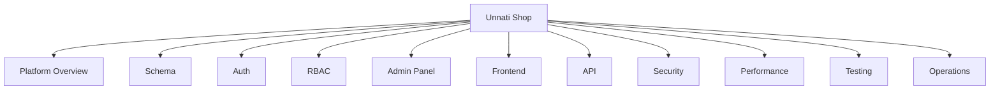

# Unnati Shop Documentation

## Table of Contents
- [Overview](#overview)
- [Documentation Map](#documentation-map)
- [How to Use These Docs](#how-to-use-these-docs)
- [Standards](#standards)
- [Future Considerations](#future-considerations)

## Overview
This directory is the canonical software documentation for **Unnati Shop**, a Laravel 12 eCommerce platform built for a production environment on PHP 8.2+, MySQL 8, Blade, Bootstrap 5.3, JavaScript, Vite, Laravel Sanctum, and Spatie Laravel Permission.

The documentation is written for senior engineers who need to understand the platform without reading every source file first. It covers the current foundation and the intended target architecture for the commerce domain.

| Document | Purpose |
|---|---|
| `01-project-overview.md` | Product vision, architecture, and scope |
| `02-folder-structure.md` | Repository layout and module boundaries |
| `03-database-design.md` | Planned schema, relationships, and constraints |
| `04-authentication.md` | Login, OTP registration, password reset, and session behavior |
| `05-authorization-rbac.md` | Role and permission model |
| `06-admin-panel.md` | Internal administration modules |
| `07-frontend.md` | Customer-facing pages and UX responsibilities |
| `08-api-design.md` | REST API conventions for web and mobile clients |
| `09-coding-standards.md` | PSR-12, service-layer rules, and code hygiene |
| `10-deployment.md` | Build, release, and hosting expectations |
| `11-roadmap.md` | Delivery phases and product milestones |
| `12-ui-ux-guidelines.md` | Design system, layout, and interaction rules |
| `13-security.md` | Defensive controls and hardening standards |
| `14-performance.md` | Caching, indexing, queues, and rendering efficiency |
| `15-testing.md` | Test strategy and coverage expectations |
| `16-seo.md` | Search and social metadata strategy |
| `17-environment-setup.md` | Local, staging, and production setup |
| `18-development-workflow.md` | Feature delivery workflow |
| `19-git-workflow.md` | Branching, commit, and review rules |
| `20-release-process.md` | Production release and rollback process |

## Documentation Map

## How to Use These Docs
1. Start with the project overview to understand the scope.
2. Read authentication and RBAC before implementing any secured feature.
3. Use the database document as the source of truth for entity design.
4. Use the admin, frontend, and API documents to keep page and endpoint behavior aligned.
5. Use the workflow, testing, and release documents before merging or shipping changes.

## Standards
| Standard | Expectation |
|---|---|
| Language | Markdown only |
| Code style reference | PSR-12 for PHP implementation guidance |
| Architecture | Service layer first, clean separation of concerns |
| Security | Validate, authorize, sanitize, and log critical actions |
| Performance | Cache where it reduces repeated work and avoid N+1 queries |
| Documentation tone | Precise, implementation-oriented, and release-ready |

## Notes
- The current codebase already includes the Laravel Breeze auth baseline, Sanctum, Spatie Permission, and OTP-related scaffolding.
- Commerce modules are documented as the intended target platform so implementation teams can build toward a stable plan.

## Best Practices
- Treat these documents as versioned product design, not informal notes.
- Update the database and API chapters before shipping schema or contract changes.
- Keep terminology consistent across UI labels, model names, and permission names.

## Future Considerations
- Add a changelog for documentation revisions once the platform becomes multi-team.
- Add architecture decision records if major implementation choices need formal traceability.
