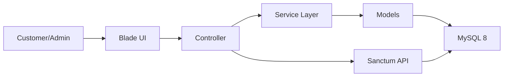

# Project Overview

## Table of Contents
- [Overview](#overview)
- [Platform Summary](#platform-summary)
- [Architecture Principles](#architecture-principles)
- [Current Foundation](#current-foundation)
- [Target Commerce Scope](#target-commerce-scope)
- [Operational Boundaries](#operational-boundaries)
- [Notes](#notes)
- [Best Practices](#best-practices)
- [Future Considerations](#future-considerations)
- [Examples](#examples)
- [Mermaid Diagram](#mermaid-diagram)

## Overview
Unnati Shop is a production-grade Laravel 12 eCommerce platform intended to support a public storefront, an internal admin panel, and API consumers from the same backend. The platform uses Blade for server-rendered pages, Bootstrap 5.3 for UI structure, JavaScript and Vite for frontend assets, MySQL 8 for persistence, Laravel Sanctum for API authentication, and Spatie Laravel Permission for role-based access control.

The implementation style is service-layer oriented. Business logic belongs in services and supporting classes, not in controllers or views.

## Platform Summary
| Area | Standard |
|---|---|
| Backend | Laravel 12, PHP 8.2+ |
| Database | MySQL 8 |
| Frontend | Blade, Bootstrap 5.3, JavaScript, Vite |
| Auth | Laravel Breeze login, custom OTP registration, OTP password recovery |
| API Auth | Laravel Sanctum |
| Authorization | Spatie Laravel Permission |
| Coding Standard | PSR-12 |
| Design Principles | SOLID, DRY, KISS, Clean Architecture |
| Primary Pattern | Service layer with thin controllers |

## Architecture Principles
| Principle | How It Applies in Unnati Shop |
|---|---|
| SOLID | Each service owns one business responsibility |
| DRY | Shared validation, OTP, and formatting logic is centralized |
| KISS | Keep flows explicit and avoid premature abstraction |
| Clean Architecture | Framework code stays at the edge, domain rules stay inside services |
| Security by design | Authentication, authorization, and rate limiting are mandatory defaults |

## Current Foundation
The current repository establishes the foundation for the platform:
- Laravel Breeze-style authentication screens and session management
- Profile management and email verification flow
- OTP models and service classes for registration and password recovery
- Sanctum token support for API access
- Spatie Permission tables for roles and permissions

## Target Commerce Scope
The documented target platform includes:
- Customer storefront pages for browsing and purchase flows
- Admin modules for catalog, order, content, and configuration management
- REST APIs for mobile and third-party clients
- SEO, performance, and security controls suitable for production commerce traffic

## Operational Boundaries
| Area | Rule |
|---|---|
| Controllers | Keep them thin; delegate business rules to services |
| Models | Use them for persistence behavior, not orchestration |
| Repositories | Not the default pattern; introduce only when a real data access boundary is needed |
| Views | No business logic in Blade templates |
| Validation | Use form requests or explicit validation rules |
| State changes | Log sensitive transitions such as order status, permissions, and authentication events |

## Notes
- The docs intentionally describe the platform as a complete commerce system even where some modules are not yet implemented in code.
- That approach keeps implementation, QA, and operations aligned on one target architecture.

## Best Practices
- Keep naming aligned across database tables, Eloquent models, UI labels, and permission identifiers.
- Introduce new modules through a documented workflow: design, schema, service, request validation, tests, then UI.
- Document any deviation from the service-layer model before implementation.

## Future Considerations
- Add domain events for order lifecycle, stock adjustments, and customer notifications.
- Introduce queue-driven background work for emails, exports, and low-priority reporting.
- Expand the API into versioned mobile and headless commerce channels.

## Examples
| Scenario | Intended Approach |
|---|---|
| Creating an order | Controller receives validated data, service performs stock and payment orchestration |
| Resetting a password | OTP or token flow is isolated from the storefront logic |
| Granting access to admin pages | Permission gates are enforced before the page loads |

## Mermaid Diagram

