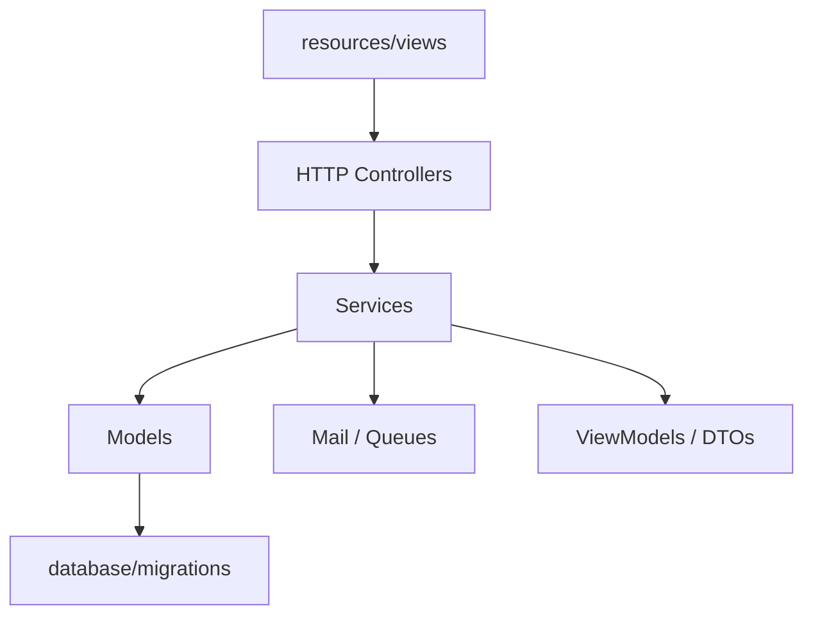
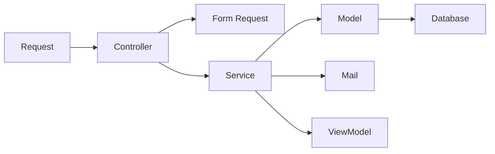

# Folder Structure

## Table of Contents
- [Overview](#overview)
- [Repository Layout](#repository-layout)
- [Application Layers](#application-layers)
- [Module Boundaries](#module-boundaries)
- [Notes](#notes)
- [Best Practices](#best-practices)
- [Future Considerations](#future-considerations)
- [Examples](#examples)
- [Mermaid Diagram](#mermaid-diagram)

## Overview
Unnati Shop uses a Laravel-native repository layout with explicit service, DTO, enum, helper, and view-model areas so the codebase can remain modular without forcing a repository-pattern-first design.

The folder structure is intentionally practical: it supports the current auth foundation and the future commerce modules without spreading business logic across the framework surface.

## Repository Layout
| Path | Purpose |
|---|---|
| `app/Http` | Controllers, form requests, and middleware-adjacent web logic |
| `app/Services` | Business orchestration and workflow logic |
| `app/DTOs` | Structured data transfer objects for service boundaries |
| `app/Enums` | Domain enumerations such as OTP purpose |
| `app/Models` | Eloquent models and persistence behavior |
| `app/Actions` | Single-purpose application actions when a task is too small for a service |
| `app/Mail` | Mail classes such as OTP delivery |
| `app/ViewModels` | View-specific data assembly for complex pages |
| `app/View` | Blade component classes |
| `app/Traits` | Shared model or service behavior that is truly cross-cutting |
| `app/Interfaces` | Contracts for exceptions where abstraction is justified |
| `app/Repositories` | Reserved for cases where a true persistence boundary is required |
| `database/migrations` | Schema definitions |
| `database/seeders` | Seed data and role bootstrap logic |
| `resources/views` | Blade templates |
| `resources/js` | Client-side scripts |
| `resources/css` | Compiled styles source |
| `routes` | Web and auth route definitions |
| `tests` | Feature, unit, and integration tests |

## Application Layers
| Layer | Responsibility |
|---|---|
| Presentation | Blade views, components, and browser interaction |
| HTTP | Requests, controllers, and middleware gating |
| Application | Services, actions, DTOs, and workflows |
| Domain | Business rules, enums, and invariants |
| Persistence | Eloquent models, migrations, and database constraints |
| Integration | Mail, queues, external APIs, and file storage |

## Module Boundaries
| Module | Owning Area |
|---|---|
| Authentication | `app/Http/Controllers/Auth`, `app/Services/Auth`, `app/Models` |
| Authorization | Spatie tables plus role and permission seeders |
| Catalog | Future product, category, brand, and inventory services |
| Orders | Future order and payment services |
| Content | Future blogs, pages, and SEO metadata services |
| Settings | Future configuration service and admin forms |

## Notes
- The `Repositories` folder exists as an escape hatch, not as the default enterprise pattern.
- The current authentication implementation is already split between controllers and services, which is the preferred direction for new modules.

## Best Practices
- Keep `Http` code focused on transport concerns only.
- Place reusable business rules in `Services` or `Actions`, not in controllers.
- Treat `ViewModels` as a way to keep Blade templates free from complex data shaping.
- Prefer explicit names such as `OrderService` or `OtpService` over generic utility classes.

## Future Considerations
- Introduce subfolders per bounded context when catalog, checkout, and CMS become larger.
- Add `Jobs` and `Events` folders when asynchronous processing becomes a core part of the platform.
- Split `Services` into domain-specific namespaces if module count expands significantly.

## Examples
| Concern | Recommended Location |
|---|---|
| Validating user input | Form request in `app/Http/Requests` |
| Generating an OTP | `app/Services/Auth/OtpService.php` |
| Formatting dashboard data | `app/ViewModels` |
| Sending transactional mail | `app/Mail` and queue job if needed |

## Mermaid Diagram

