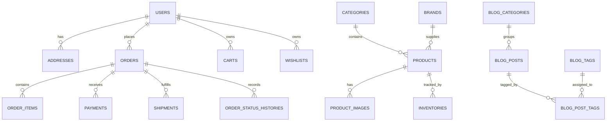
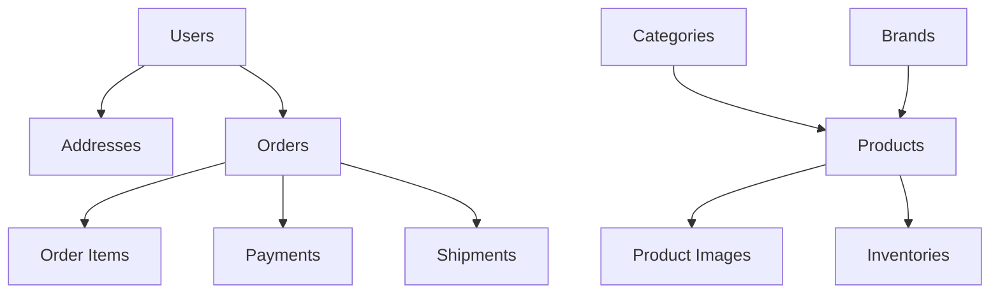

# Database Design

## Table of Contents
- [Overview](#overview)
- [Schema Strategy](#schema-strategy)
- [Core Platform Tables](#core-platform-tables)
- [Authorization Tables](#authorization-tables)
- [Commerce Tables](#commerce-tables)
- [Content and Operations Tables](#content-and-operations-tables)
- [Relationship Map](#relationship-map)
- [Notes](#notes)
- [Best Practices](#best-practices)
- [Future Considerations](#future-considerations)
- [Examples](#examples)
- [Mermaid Diagram](#mermaid-diagram)

## Overview
Unnati Shop uses MySQL 8 as the system of record for users, authentication state, roles, permissions, catalog data, orders, content, and operational logs. The current codebase already contains the authentication and RBAC foundation. The remaining commerce schema in this document defines the target production model for the storefront and admin panel.

## Schema Strategy
| Design Rule | Implementation Standard |
|---|---|
| Primary keys | Unsigned big integers with auto-increment IDs |
| Timestamps | `created_at` and `updated_at` on mutable business tables |
| Soft deletes | Use where recovery and auditability matter, especially catalog and content |
| Foreign keys | Enforce referential integrity on transactional tables |
| Indexing | Index foreign keys, status fields, and search columns |
| Slugs | Unique per content and catalog entity where public URLs depend on them |
| State tracking | Use explicit status columns instead of implicit inference |

## Core Platform Tables

### `users`
| Aspect | Details |
|---|---|
| Purpose | Store customer, admin, and staff identities |
| Columns | `id`, `name`, `email`, `email_verified_at`, `password`, `phone`, `avatar`, `status`, `last_login_at`, `last_login_ip`, `remember_token`, timestamps |
| Types | String, timestamp, boolean, nullable string fields for contact and profile data |
| Indexes | Unique on `email`; index on `status` and `last_login_at` is recommended |
| Relationships | Has many orders, addresses, carts, wishlists, OTP entries, roles, and permissions |
| Business Rules | Email is unique; status controls account access; password must be hashed |
| Validation Rules | Name required; email required and unique; phone normalized; avatar restricted to valid image files |
| Future Expansion | Add customer tier, marketing consent, and preferred language fields |
| Suggested Constraints | Lowercase email storage; phone length limit; avatar path validation |

### `password_reset_tokens`
| Aspect | Details |
|---|---|
| Purpose | Support token-based password recovery where needed |
| Columns | `email`, `token`, `created_at` |
| Types | String and timestamp |
| Indexes | Primary key on `email` |
| Relationships | Linked logically to `users.email` |
| Business Rules | One active reset token per email |
| Validation Rules | Token must be time-limited and single-use |
| Future Expansion | Could be replaced with OTP-based reset only if product policy changes |
| Suggested Constraints | Expire tokens aggressively and purge old rows |

### `sessions`
| Aspect | Details |
|---|---|
| Purpose | Store server-side sessions for web login state |
| Columns | `id`, `user_id`, `ip_address`, `user_agent`, `payload`, `last_activity` |
| Types | String, integer, long text |
| Indexes | Index on `user_id` and `last_activity` |
| Relationships | Optional link to `users.id` |
| Business Rules | Authenticated sessions should be invalidated on logout and password reset |
| Validation Rules | User agent and IP address are informational, not trusted inputs |
| Future Expansion | Session analytics and device history |
| Suggested Constraints | Prune stale sessions on a schedule |

### `personal_access_tokens`
| Aspect | Details |
|---|---|
| Purpose | Sanctum tokens for API authentication |
| Columns | `id`, `tokenable_type`, `tokenable_id`, `name`, `token`, `abilities`, `last_used_at`, `expires_at`, timestamps |
| Types | Morph relation, string, text, timestamp |
| Indexes | Unique on `token`; index on `expires_at` |
| Relationships | Polymorphic relation to token owners, primarily `users` |
| Business Rules | Tokens should be scoped by ability and expiration |
| Validation Rules | Generate only for authenticated users or approved service flows |
| Future Expansion | Device-bound tokens and token usage auditing |
| Suggested Constraints | Revoke on suspicious activity and after long inactivity |

### `pending_registrations`
| Aspect | Details |
|---|---|
| Purpose | Hold unverified user signups before OTP confirmation |
| Columns | `id`, `name`, `email`, `phone`, `password`, timestamps |
| Types | String, nullable string, hashed password string |
| Indexes | Unique on `email`; index on `email` for lookup performance |
| Relationships | One pending registration becomes one verified user |
| Business Rules | Record is temporary and should be deleted after verification or expiry |
| Validation Rules | Name, email, and password must be validated before storage |
| Future Expansion | Add OTP metadata columns if registration state becomes more complex |
| Suggested Constraints | Expire and purge rows based on verification window |

### `otps`
| Aspect | Details |
|---|---|
| Purpose | Store OTP hashes and delivery tracking across multiple flows |
| Columns | `id`, `identifier`, `type`, `purpose`, `otp`, `expires_at`, `verified_at`, `attempts`, `resend_count`, `last_resend_at`, timestamps |
| Types | String, timestamp, unsigned tiny integer |
| Indexes | Composite index on `identifier` and `purpose`; index on `expires_at` |
| Relationships | Linked logically to user identity channels such as email or phone |
| Business Rules | OTPs are single-purpose, expire quickly, and are invalid after too many attempts |
| Validation Rules | Identifier format depends on `type`; OTP length must match configuration |
| Future Expansion | Support SMS delivery and multi-factor authentication |
| Suggested Constraints | Hash OTPs at rest; throttle resend and verification attempts |

## Authorization Tables

### `permissions`
| Aspect | Details |
|---|---|
| Purpose | Atomic permission definitions for RBAC |
| Columns | `id`, `name`, `guard_name`, timestamps |
| Types | String fields with timestamps |
| Indexes | Unique on `name` and `guard_name` |
| Relationships | Many-to-many with roles and direct model assignment |
| Business Rules | Permission names are canonical and should never be duplicated |
| Validation Rules | Use a fixed naming convention such as `module.action` |
| Future Expansion | Add grouped permissions or permission labels for admin UX |
| Suggested Constraints | Keep guard name aligned with actual auth guard usage |

### `roles`
| Aspect | Details |
|---|---|
| Purpose | Role definitions such as Super Admin, Admin, Manager, Editor, Support, Customer |
| Columns | `id`, `name`, `guard_name`, timestamps |
| Types | String fields with timestamps |
| Indexes | Unique on `name` and `guard_name` |
| Relationships | Many-to-many with permissions and morph assignment to users |
| Business Rules | One user can hold multiple roles if policy allows it |
| Validation Rules | Role names must be unique and human readable |
| Future Expansion | Add descriptive labels and dashboard order |
| Suggested Constraints | Protect Super Admin from accidental deletion |

### `model_has_permissions`
| Aspect | Details |
|---|---|
| Purpose | Direct permission assignment to users or other authorized models |
| Columns | `permission_id`, `model_type`, `model_id` |
| Types | Foreign key and morph key columns |
| Indexes | Composite index on `model_id` and `model_type` |
| Relationships | Joins models to permissions |
| Business Rules | Use sparingly when a role is too coarse |
| Validation Rules | Assign only valid permissions from the catalog |
| Future Expansion | Support team-aware permissions if needed later |
| Suggested Constraints | Cascade on permission deletion |

### `model_has_roles`
| Aspect | Details |
|---|---|
| Purpose | Assign roles to users |
| Columns | `role_id`, `model_type`, `model_id` |
| Types | Foreign key and morph key columns |
| Indexes | Composite index on `model_id` and `model_type` |
| Relationships | Joins users to roles |
| Business Rules | Roles drive most admin access decisions |
| Validation Rules | User must exist and be eligible for the role |
| Future Expansion | Team-aware role assignment if organizational separation is introduced |
| Suggested Constraints | Cascade on role deletion |

### `role_has_permissions`
| Aspect | Details |
|---|---|
| Purpose | Map roles to permission bundles |
| Columns | `permission_id`, `role_id` |
| Types | Foreign keys |
| Indexes | Composite primary key |
| Relationships | Connects roles and permissions |
| Business Rules | Super Admin typically receives full coverage |
| Validation Rules | Prevent orphaned role-permission links |
| Future Expansion | Permission groups or module bundles |
| Suggested Constraints | Cascade on parent deletion |

## Commerce Tables

### `categories`
| Aspect | Details |
|---|---|
| Purpose | Organize products into browsable catalog groups |
| Columns | `id`, `parent_id`, `name`, `slug`, `description`, `image`, `is_active`, `sort_order`, timestamps, soft deletes |
| Types | Integer, string, text, boolean |
| Indexes | Unique on `slug`; index on `parent_id`, `is_active`, and `sort_order` |
| Relationships | Self-referencing parent-child tree; has many products |
| Business Rules | Slug must be unique; inactive categories cannot be used on the storefront |
| Validation Rules | Name required; slug normalized; image must be valid |
| Future Expansion | Category banners, SEO metadata, and featured flags |
| Suggested Constraints | Prevent circular parent chains |

### `brands`
| Aspect | Details |
|---|---|
| Purpose | Group products by manufacturer or label |
| Columns | `id`, `name`, `slug`, `logo`, `website_url`, `is_active`, timestamps, soft deletes |
| Types | String, URL, boolean |
| Indexes | Unique on `slug`; index on `is_active` |
| Relationships | Has many products |
| Business Rules | A brand can be hidden without deleting historical products |
| Validation Rules | Logo and website URLs must be valid |
| Future Expansion | Brand story pages and featured brand slots |
| Suggested Constraints | Prevent duplicate brand slugs |

### `products`
| Aspect | Details |
|---|---|
| Purpose | Store sellable catalog items |
| Columns | `id`, `category_id`, `brand_id`, `name`, `slug`, `sku`, `short_description`, `description`, `base_price`, `sale_price`, `is_active`, `is_featured`, `is_digital`, `meta_title`, `meta_description`, timestamps, soft deletes |
| Types | Foreign keys, string, text, decimal, boolean |
| Indexes | Unique on `slug` and `sku`; index on `category_id`, `brand_id`, `is_active`, `is_featured` |
| Relationships | Belongs to category and brand; has many images, variants, inventory records, reviews |
| Business Rules | SKU must be unique; active product should always have at least one purchasable variant or base price |
| Validation Rules | Price must be non-negative; slug unique; descriptions sanitized for output |
| Future Expansion | Variant-level attributes, bundles, and subscriptions |
| Suggested Constraints | Prevent negative pricing and duplicate SKU values |

### `product_images`
| Aspect | Details |
|---|---|
| Purpose | Store gallery and variant images |
| Columns | `id`, `product_id`, `variant_id`, `path`, `alt_text`, `is_primary`, `sort_order`, timestamps |
| Types | Foreign keys, string, boolean, integer |
| Indexes | Index on `product_id`, `variant_id`, `is_primary`, `sort_order` |
| Relationships | Belongs to product and optionally variant |
| Business Rules | One primary image per product or variant should be enforced by service logic |
| Validation Rules | File type and dimensions must be validated before upload |
| Future Expansion | CDN-backed responsive image sets |
| Suggested Constraints | Reject orphan image rows |

### `inventories`
| Aspect | Details |
|---|---|
| Purpose | Track stock at product or variant level |
| Columns | `id`, `product_id`, `variant_id`, `available_qty`, `reserved_qty`, `low_stock_threshold`, `last_restocked_at`, timestamps |
| Types | Foreign keys, integer, timestamp |
| Indexes | Index on `product_id`, `variant_id`, and stock status fields |
| Relationships | Belongs to product and optionally variant |
| Business Rules | Available quantity must never be negative |
| Validation Rules | Reserve and release changes must be atomic |
| Future Expansion | Warehouse-level stock and stock movement logs |
| Suggested Constraints | Use database transactions for stock adjustments |

### `coupons`
| Aspect | Details |
|---|---|
| Purpose | Manage promotional discounts |
| Columns | `id`, `code`, `type`, `value`, `min_order_amount`, `max_discount_amount`, `usage_limit`, `per_customer_limit`, `starts_at`, `ends_at`, `is_active`, timestamps |
| Types | String, decimal, integer, timestamp, boolean |
| Indexes | Unique on `code`; index on `is_active`, `starts_at`, `ends_at` |
| Relationships | Used by orders and cart calculations |
| Business Rules | Coupon windows and usage limits must be enforced at checkout |
| Validation Rules | Code normalized to uppercase; values must be within policy ranges |
| Future Expansion | Coupon targeting by category, product, or customer segment |
| Suggested Constraints | Disallow overlapping invalid states such as active but expired |

### `carts`
| Aspect | Details |
|---|---|
| Purpose | Hold the current shopping state for a guest or logged-in user |
| Columns | `id`, `user_id`, `session_id`, `currency`, `subtotal`, `discount_total`, `shipping_total`, `grand_total`, timestamps |
| Types | Foreign key, string, decimal |
| Indexes | Index on `user_id`, `session_id` |
| Relationships | Has many cart items |
| Business Rules | One active cart per user or session |
| Validation Rules | Monetary fields are system-calculated |
| Future Expansion | Saved carts and shareable cart links |
| Suggested Constraints | Merge guest cart into user cart on login |

### `cart_items`
| Aspect | Details |
|---|---|
| Purpose | Store cart line items |
| Columns | `id`, `cart_id`, `product_id`, `variant_id`, `quantity`, `unit_price`, `line_total`, timestamps |
| Types | Foreign keys, integer, decimal |
| Indexes | Unique on `cart_id` plus `product_id` plus `variant_id`; index on `cart_id` |
| Relationships | Belongs to cart, product, and optionally variant |
| Business Rules | Quantity must be positive and available stock must be checked |
| Validation Rules | Prevent duplicate line collisions by merging identical lines |
| Future Expansion | Gift-wrap and item-level coupon support |
| Suggested Constraints | Recompute totals server-side only |

### `wishlists`
| Aspect | Details |
|---|---|
| Purpose | Persist a user wishlist |
| Columns | `id`, `user_id`, timestamps |
| Types | Foreign key |
| Indexes | Unique on `user_id` |
| Relationships | Has many wishlist items |
| Business Rules | One wishlist per user by default |
| Validation Rules | User must be authenticated for persistent wishlists |
| Future Expansion | Public wishlists and collaboration |
| Suggested Constraints | Prevent duplicates per user |

### `wishlist_items`
| Aspect | Details |
|---|---|
| Purpose | Store wished products |
| Columns | `id`, `wishlist_id`, `product_id`, `variant_id`, timestamps |
| Types | Foreign keys |
| Indexes | Unique on wishlist, product, and variant combination |
| Relationships | Belongs to wishlist and product |
| Business Rules | A product should not appear twice in the same wishlist |
| Validation Rules | Variant must belong to the selected product |
| Future Expansion | Wishlist notes and alerts |
| Suggested Constraints | Cascade on wishlist deletion |

### `addresses`
| Aspect | Details |
|---|---|
| Purpose | Store customer billing and shipping addresses |
| Columns | `id`, `user_id`, `type`, `first_name`, `last_name`, `phone`, `line1`, `line2`, `city`, `state`, `postal_code`, `country`, `is_default`, timestamps, soft deletes |
| Types | Foreign key, string, boolean |
| Indexes | Index on `user_id`, `type`, `is_default`, `postal_code` |
| Relationships | Belongs to user; referenced by orders |
| Business Rules | Default shipping address should be clearly marked |
| Validation Rules | Required fields depend on delivery country |
| Future Expansion | Address verification and geocoding |
| Suggested Constraints | Prevent invalid country or postal code formats |

### `orders`
| Aspect | Details |
|---|---|
| Purpose | Store checkout transactions and order lifecycle state |
| Columns | `id`, `order_number`, `user_id`, `status`, `payment_status`, `currency`, `subtotal`, `discount_total`, `shipping_total`, `tax_total`, `grand_total`, `coupon_code`, `billing_address_snapshot`, `shipping_address_snapshot`, `placed_at`, timestamps |
| Types | String, foreign key, decimal, JSON/text snapshots, timestamp |
| Indexes | Unique on `order_number`; index on `user_id`, `status`, `payment_status`, `placed_at` |
| Relationships | Has many order items, payments, shipments, and status history entries |
| Business Rules | Order totals are immutable after placement except through controlled adjustments |
| Validation Rules | Checkout must require valid address and stock availability |
| Future Expansion | Split shipments, refunds, and order editing windows |
| Suggested Constraints | Persist address snapshots so historical orders remain accurate |

### `order_items`
| Aspect | Details |
|---|---|
| Purpose | Store line items for each order |
| Columns | `id`, `order_id`, `product_id`, `variant_id`, `product_name_snapshot`, `sku_snapshot`, `quantity`, `unit_price`, `discount_amount`, `tax_amount`, `line_total`, timestamps |
| Types | Foreign keys, string snapshots, integer, decimal |
| Indexes | Index on `order_id`, `product_id`, `variant_id` |
| Relationships | Belongs to order and product |
| Business Rules | Snapshots must preserve order history even if product data changes later |
| Validation Rules | Quantity and price cannot be negative |
| Future Expansion | Service and bundle line types |
| Suggested Constraints | Use the snapshot values for reporting |

### `payments`
| Aspect | Details |
|---|---|
| Purpose | Record payment attempts and confirmations |
| Columns | `id`, `order_id`, `provider`, `transaction_id`, `status`, `amount`, `currency`, `paid_at`, `raw_payload`, timestamps |
| Types | Foreign key, string, decimal, timestamp, JSON/text payload |
| Indexes | Unique on `transaction_id`; index on `order_id`, `provider`, `status` |
| Relationships | Belongs to order |
| Business Rules | Payment state must map to a recognized gateway status |
| Validation Rules | Store gateway payloads without exposing secrets |
| Future Expansion | Refund records and partial capture |
| Suggested Constraints | Prevent duplicate provider transaction IDs |

### `shipments`
| Aspect | Details |
|---|---|
| Purpose | Track fulfillment and delivery progress |
| Columns | `id`, `order_id`, `carrier`, `tracking_number`, `status`, `shipped_at`, `delivered_at`, `estimated_delivery_at`, timestamps |
| Types | Foreign key, string, timestamp |
| Indexes | Index on `order_id`, `tracking_number`, `status` |
| Relationships | Belongs to order |
| Business Rules | Shipment status must follow the fulfillment lifecycle |
| Validation Rules | Tracking number format depends on carrier integration |
| Future Expansion | Multi-parcel shipments and shipping labels |
| Suggested Constraints | Keep shipment status history in sync with orders |

### `order_status_histories`
| Aspect | Details |
|---|---|
| Purpose | Maintain an audit trail of order status changes |
| Columns | `id`, `order_id`, `from_status`, `to_status`, `changed_by`, `notes`, timestamps |
| Types | Foreign keys, string, text |
| Indexes | Index on `order_id`, `changed_by`, `created_at` |
| Relationships | Belongs to order and user who changed it |
| Business Rules | Every meaningful order transition should be recorded |
| Validation Rules | Status transitions should be validated against an allowed map |
| Future Expansion | Reason codes and automated transition sources |
| Suggested Constraints | Prevent status regression without explicit override logic |

## Content and Operations Tables

### `blog_categories`
| Aspect | Details |
|---|---|
| Purpose | Organize blog articles |
| Columns | `id`, `name`, `slug`, `description`, `is_active`, timestamps |
| Types | String, text, boolean |
| Indexes | Unique on `slug`; index on `is_active` |
| Relationships | Has many blog posts |
| Business Rules | Category slugs must be unique |
| Validation Rules | Title case naming is preferred for editor clarity |
| Future Expansion | Nested blog categories |
| Suggested Constraints | Disable categories instead of deleting published content history |

### `blog_posts`
| Aspect | Details |
|---|---|
| Purpose | Store SEO-friendly articles and educational content |
| Columns | `id`, `blog_category_id`, `title`, `slug`, `excerpt`, `content`, `featured_image`, `published_at`, `is_published`, `meta_title`, `meta_description`, timestamps, soft deletes |
| Types | Foreign key, string, text, timestamp, boolean |
| Indexes | Unique on `slug`; index on `blog_category_id`, `is_published`, `published_at` |
| Relationships | Belongs to blog category; has many tags via pivot |
| Business Rules | Only published posts should appear publicly |
| Validation Rules | Slug unique; content sanitized for allowed HTML |
| Future Expansion | Author attribution and scheduled publishing |
| Suggested Constraints | Preserve old slugs through redirects when possible |

### `blog_tags`
| Aspect | Details |
|---|---|
| Purpose | Tag blog content for discovery |
| Columns | `id`, `name`, `slug`, timestamps |
| Types | String |
| Indexes | Unique on `slug` |
| Relationships | Many-to-many with blog posts |
| Business Rules | Tags should be reusable and not duplicated |
| Validation Rules | Normalize case and whitespace |
| Future Expansion | Tag popularity metrics |
| Suggested Constraints | Prevent duplicate names with different casing |

### `blog_post_tags`
| Aspect | Details |
|---|---|
| Purpose | Pivot table for blog posts and tags |
| Columns | `blog_post_id`, `blog_tag_id` |
| Types | Foreign keys |
| Indexes | Composite primary key |
| Relationships | Connects blog posts and tags |
| Business Rules | A post can use many tags; a tag can apply to many posts |
| Validation Rules | Prevent duplicate pair inserts |
| Future Expansion | Tag ordering on posts |
| Suggested Constraints | Cascade deletes from both parents |

### `pages`
| Aspect | Details |
|---|---|
| Purpose | Store CMS pages such as About, Terms, Privacy, and Shipping Policy |
| Columns | `id`, `title`, `slug`, `content`, `meta_title`, `meta_description`, `is_published`, `published_at`, timestamps, soft deletes |
| Types | String, text, timestamp, boolean |
| Indexes | Unique on `slug`; index on `is_published` |
| Relationships | Standalone content entity |
| Business Rules | Published pages must have a unique URL slug |
| Validation Rules | Content HTML should be sanitized |
| Future Expansion | Page sections and localization |
| Suggested Constraints | Preserve page slugs for SEO continuity |

### `settings`
| Aspect | Details |
|---|---|
| Purpose | Store application configuration editable from admin |
| Columns | `id`, `group`, `key`, `value`, `type`, `is_public`, timestamps |
| Types | String, text, boolean |
| Indexes | Unique on `group` and `key`; index on `is_public` |
| Relationships | Standalone system table |
| Business Rules | Sensitive settings should never be publicly exposed |
| Validation Rules | Type-specific value validation is mandatory |
| Future Expansion | Media settings, SEO defaults, store profile, and payment credentials |
| Suggested Constraints | Encrypt sensitive values at rest when needed |

### `activity_logs`
| Aspect | Details |
|---|---|
| Purpose | Audit sensitive administrative and customer actions |
| Columns | `id`, `user_id`, `action`, `subject_type`, `subject_id`, `properties`, `ip_address`, `user_agent`, timestamps |
| Types | Foreign key, string, morph fields, JSON/text, timestamps |
| Indexes | Index on `user_id`, `action`, `subject_type`, `subject_id`, `created_at` |
| Relationships | Belongs to user; polymorphic subject |
| Business Rules | Critical changes such as role updates, order edits, and settings changes should be logged |
| Validation Rules | Avoid logging secrets or raw passwords |
| Future Expansion | Separate security audit log stream |
| Suggested Constraints | Retain logs according to compliance policy |

### `report_snapshots`
| Aspect | Details |
|---|---|
| Purpose | Store precomputed reporting data for fast dashboards |
| Columns | `id`, `report_key`, `period_start`, `period_end`, `payload`, `generated_at`, timestamps |
| Types | String, timestamp, JSON/text payload |
| Indexes | Unique on `report_key` and period range; index on `generated_at` |
| Relationships | Standalone report cache table |
| Business Rules | Snapshot data is generated, not manually edited |
| Validation Rules | Payload structure must match report contract |
| Future Expansion | Daily, weekly, and monthly aggregations |
| Suggested Constraints | Regenerate snapshots when source logic changes |

## Relationship Map

## Notes
- The current codebase already implements the identity and authorization foundation, so the schema design focuses heavily on catalog, checkout, and content relationships.
- Transactional tables should prefer snapshots where historical accuracy matters.

## Best Practices
- Keep public URLs stable through slug uniqueness and redirect planning.
- Use database transactions for checkout, payment confirmation, and stock reservation.
- Store money in decimal columns and never derive totals from client payloads.
- Prefer soft deletes for content and catalog records that may be referenced historically.

## Future Considerations
- Introduce warehouse-level inventory if operations become multi-location.
- Consider localization tables if the storefront expands to multiple languages.
- Split reporting into a separate warehouse if analytics volume grows significantly.

## Examples
| Scenario | Recommended Table Pattern |
|---|---|
| Category tree | Self-referencing `categories.parent_id` |
| Checkout totals | Immutable `orders` snapshot plus child `order_items` |
| Fast lookup of a coupon | Unique coupon code plus active window index |
| Order auditing | Append-only `order_status_histories` |

## Mermaid Diagram

