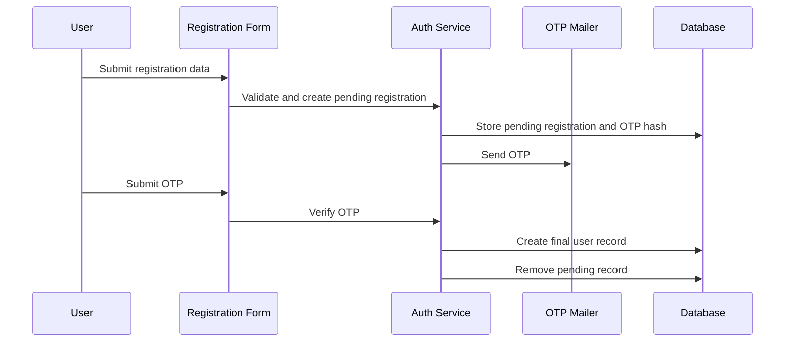
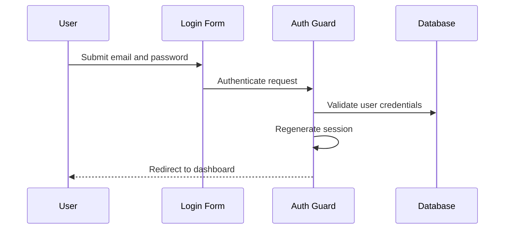
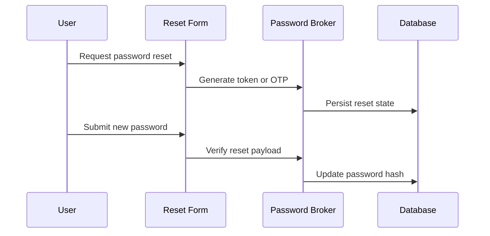
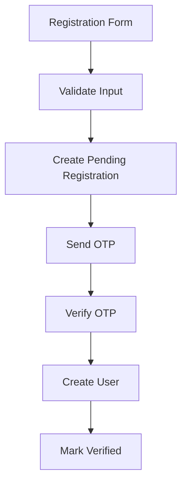

# Authentication

## Table of Contents
- [Overview](#overview)
- [Authentication Model](#authentication-model)
- [Registration Flow](#registration-flow)
- [OTP Flow](#otp-flow)
- [Login Flow](#login-flow)
- [Forgot Password Flow](#forgot-password-flow)
- [Remember Me](#remember-me)
- [Sessions](#sessions)
- [Rate Limiting](#rate-limiting)
- [Security](#security)
- [Notes](#notes)
- [Best Practices](#best-practices)
- [Future Considerations](#future-considerations)
- [Examples](#examples)
- [Mermaid Diagrams](#mermaid-diagrams)

## Overview
Unnati Shop uses a mixed authentication model:
- Web login is based on Laravel Breeze.
- New user registration is OTP-driven and stored in a pending state until verification.
- Password recovery uses OTP or token-based recovery depending on the flow in use.
- API access uses Laravel Sanctum personal access tokens.

The auth design is intentionally conservative. A user is never treated as active until identity verification succeeds.

## Authentication Model
| Channel | Mechanism | Storage | Typical Use |
|---|---|---|---|
| Web login | Laravel Breeze session auth | `sessions` table and encrypted cookies | Storefront and admin browser access |
| Registration | Email OTP verification | `pending_registrations` and `otps` | New customer signup |
| Password recovery | OTP or token reset | `otps` or `password_reset_tokens` | Account recovery |
| API auth | Sanctum token auth | `personal_access_tokens` | Mobile apps and headless clients |

## Registration Flow
The registration flow is designed around verification before activation.

1. User submits name, email, phone, and password.
2. Application validates uniqueness and password policy.
3. A pending registration record is created with a hashed password and OTP hash.
4. OTP is delivered by email.
5. User enters OTP on the verification screen.
6. If OTP is valid and not expired, the system creates the final `users` record.
7. The pending registration record is removed.
8. The user can then log in and complete profile setup.

| Step | Server Action | Data State |
|---|---|---|
| Submit | Validate request and create pending record | Temporary identity stored |
| Deliver OTP | Send OTP email | Verification pending |
| Verify OTP | Compare hash, track attempts | Identity confirmed |
| Activate | Create final user and mark verified | Account active |

## OTP Flow
OTP handling is shared across registration, login, password recovery, and future change-email or two-factor flows.

| Aspect | Standard |
|---|---|
| Length | Configuration-driven, typically 6 digits |
| Storage | Hash OTP before persistence |
| Validity | Short-lived, measured in minutes |
| Attempts | Count failed verifications and block after threshold |
| Resend | Enforce cooldown plus resend limits |
| Purpose | Always bind OTP to a single purpose and identifier |

### OTP Business Rules
- One OTP maps to one identifier and one purpose.
- A verified OTP cannot be reused.
- Resend requests must respect cooldown rules.
- Expired OTP records should be invalidated or cleaned up.

## Login Flow
The login flow follows Laravel Breeze session auth with additional project-specific expectations.

1. User submits email and password.
2. Credentials are validated.
3. If authentication succeeds, the session is regenerated.
4. `remember me` optionally issues a long-lived remember token.
5. The user is redirected to the intended route or dashboard.

| Condition | Result |
|---|---|
| Invalid credentials | Reject with generic error |
| Unverified account | Redirect to verification flow if applicable |
| Disabled account | Deny login even with correct credentials |
| Successful login | Regenerate session and store last login metadata |

## Forgot Password Flow
The platform supports password recovery with email-based validation and a reset step.

1. User submits email on the forgot-password screen.
2. System checks that the email exists.
3. A reset token or OTP is generated and delivered.
4. User opens the reset link or OTP verification screen.
5. User submits a new password.
6. Password hash is updated.
7. Existing sessions are invalidated if required by policy.

| Control | Expected Behavior |
|---|---|
| Token expiry | Short and enforced server-side |
| Password policy | Must satisfy configured defaults |
| Session invalidation | Recommended after reset |
| Audit logging | Log recovery events without sensitive payloads |

## Remember Me
| Aspect | Behavior |
|---|---|
| Purpose | Keep trusted browser sessions active longer |
| Mechanism | Laravel remember token and persistent cookie |
| Risk | Compromised browsers can retain access |
| Recommendation | Allow for customers, review for admin accounts |

Admin accounts should either disable remember-me or enforce a shorter session policy than customer accounts.

## Sessions
| Area | Standard |
|---|---|
| Session driver | Database in production is the safest default for observability |
| Regeneration | Regenerate session ID after login and privilege changes |
| Invalidation | Destroy old sessions on logout and sensitive updates |
| Idle timeout | Enforce a practical inactivity timeout for privileged users |

## Rate Limiting
Rate limiting must be applied to every public identity endpoint.

| Endpoint Category | Recommended Rule |
|---|---|
| Login | Limit repeated attempts per email and IP |
| Registration | Limit account creation attempts per IP |
| OTP verify | Limit failed code submissions per identifier |
| OTP resend | Limit resend frequency and daily volume |
| Password reset | Limit reset requests per email and IP |

## Security
| Risk | Control |
|---|---|
| Credential stuffing | Throttle login attempts and use generic error messages |
| OTP guessing | Short OTP lifetime, attempt counters, and hash storage |
| Session hijacking | Secure cookies, regeneration, and logout invalidation |
| Enumeration | Return non-revealing responses for account lookup operations |
| Abuse of resend | Cooldown plus max resend counts |

## Notes
- The current codebase already includes standard Breeze views and controllers, but the OTP registration model is the platform direction and should remain the documented standard.
- OTP and password reset behavior must be consistent across web and API entry points.

## Best Practices
- Hash OTPs and passwords immediately when received.
- Prefer generic error messages for auth failures.
- Store last login IP and timestamp for auditability.
- Regenerate sessions on login and after privilege-sensitive transitions.

## Future Considerations
- Add optional two-factor authentication using the same OTP substrate.
- Add device management for user account sessions.
- Introduce passwordless login only if it does not weaken account recovery rules.

## Examples
| Scenario | Expected Result |
|---|---|
| Incorrect password | Authentication fails without telling the attacker whether the email exists |
| Valid OTP but expired | Verification is rejected and resend rules apply |
| Reset password from a new device | Old session should be invalidated if policy requires it |

## Mermaid Diagrams

