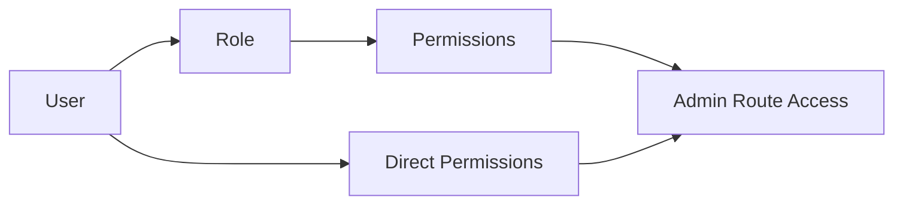

# Authorization and RBAC

## Table of Contents
- [Overview](#overview)
- [Role Model](#role-model)
- [Permission Naming Convention](#permission-naming-convention)
- [Module Permission Matrix](#module-permission-matrix)
- [Role Capability Matrix](#role-capability-matrix)
- [Assignment Rules](#assignment-rules)
- [Notes](#notes)
- [Best Practices](#best-practices)
- [Future Considerations](#future-considerations)
- [Examples](#examples)
- [Mermaid Diagram](#mermaid-diagram)

## Overview
Unnati Shop uses Spatie Laravel Permission as the authorization backbone. Roles describe responsibility, permissions describe concrete actions, and policies or gates can be added later for resource-specific conditions.

Authorization must be explicit. Every protected admin page, API route, and sensitive action should be guarded by a permission check or a policy.

## Role Model
| Role | Responsibility | Scope |
|---|---|---|
| Super Admin | Full platform ownership | All modules, all settings, all audit actions |
| Admin | Daily platform administration | Most admin modules except destructive platform controls |
| Manager | Operational oversight | Catalog, orders, reports, and limited settings |
| Editor | Content and catalog curation | Blogs, pages, category copy, product content |
| Support | Customer support operations | Orders, users read access, issue resolution |
| Customer | Storefront user | Personal account, shopping, and order history |

## Permission Naming Convention
The canonical permission format is:

`module.action`

### Rules
- Use lowercase names.
- Use dots to separate module and action.
- Use singular module names for consistency.
- Keep actions short and predictable.

### Core Actions
| Action | Meaning |
|---|---|
| `view` | Read a page or resource |
| `create` | Create a new resource |
| `edit` | Update an existing resource |
| `delete` | Remove a resource |
| `manage` | Composite permission for broad operational control |
| `publish` | Make content public |
| `approve` | Approve a workflow step |
| `export` | Export data outside the system |

## Module Permission Matrix
| Module | Permission Prefix | Typical Actions |
|---|---|---|
| Dashboard | `dashboard` | `view` |
| Users | `user` | `view`, `create`, `edit`, `delete`, `status` |
| Roles | `role` | `view`, `create`, `edit`, `delete` |
| Permissions | `permission` | `view`, `assign`, `sync` |
| Categories | `category` | `view`, `create`, `edit`, `delete`, `reorder` |
| Brands | `brand` | `view`, `create`, `edit`, `delete` |
| Products | `product` | `view`, `create`, `edit`, `delete`, `publish`, `feature` |
| Orders | `order` | `view`, `edit`, `cancel`, `status`, `refund`, `export` |
| Coupons | `coupon` | `view`, `create`, `edit`, `delete`, `activate` |
| Blogs | `blog` | `view`, `create`, `edit`, `delete`, `publish` |
| Pages | `page` | `view`, `create`, `edit`, `delete`, `publish` |
| Settings | `setting` | `view`, `edit` |
| Logs | `log` | `view`, `export`, `purge` |
| Reports | `report` | `view`, `export` |

### Required Permission Set
The platform should create permissions using these exact prefixes:

| Module | Permissions |
|---|---|
| Dashboard | `dashboard.view` |
| Users | `user.view`, `user.create`, `user.edit`, `user.delete`, `user.status` |
| Roles | `role.view`, `role.create`, `role.edit`, `role.delete` |
| Permissions | `permission.view`, `permission.assign`, `permission.sync` |
| Categories | `category.view`, `category.create`, `category.edit`, `category.delete`, `category.reorder` |
| Brands | `brand.view`, `brand.create`, `brand.edit`, `brand.delete` |
| Products | `product.view`, `product.create`, `product.edit`, `product.delete`, `product.publish`, `product.feature` |
| Orders | `order.view`, `order.edit`, `order.cancel`, `order.status`, `order.refund`, `order.export` |
| Coupons | `coupon.view`, `coupon.create`, `coupon.edit`, `coupon.delete`, `coupon.activate` |
| Blogs | `blog.view`, `blog.create`, `blog.edit`, `blog.delete`, `blog.publish` |
| Pages | `page.view`, `page.create`, `page.edit`, `page.delete`, `page.publish` |
| Settings | `setting.view`, `setting.edit` |
| Logs | `log.view`, `log.export`, `log.purge` |
| Reports | `report.view`, `report.export` |

## Role Capability Matrix
| Permission Area | Super Admin | Admin | Manager | Editor | Support | Customer |
|---|---|---|---|---|---|---|
| Dashboard | Yes | Yes | Yes | Limited | Limited | No |
| Users | Yes | Yes | Read/limited edit | No | Read only | Self only |
| Roles | Yes | Yes | No | No | No | No |
| Permissions | Yes | No | No | No | No | No |
| Categories | Yes | Yes | Yes | Content only | No | No |
| Brands | Yes | Yes | Yes | Content only | No | No |
| Products | Yes | Yes | Yes | Content only | No | No |
| Orders | Yes | Yes | Yes | Read only | Support actions | Own orders only |
| Coupons | Yes | Yes | Yes | No | No | No |
| Blogs | Yes | Yes | Yes | Yes | No | No |
| Pages | Yes | Yes | Yes | Yes | No | No |
| Settings | Yes | Limited | No | No | No | No |
| Logs | Yes | Yes | Read only | Read only | Read only | No |
| Reports | Yes | Yes | Yes | Read only | Read only | No |

## Assignment Rules
| Rule | Standard |
|---|---|
| Default customer role | Assign on self-registration completion |
| Admin onboarding | Require explicit internal assignment |
| Super Admin | Seed only, protect from accidental removal |
| Multi-role users | Allowed only if the business case is documented |
| Direct permissions | Use sparingly and only for exceptional cases |
| Permission cache | Clear cached permissions after any role or permission mutation |

## Notes
- Permissions should be created in a deterministic order during seeding so the admin panel remains stable.
- Role names and permission names must match the human language used in the UI and documentation.

## Best Practices
- Check permissions at the route or controller boundary, not only in Blade.
- Prefer role-based access for coarse admin access and permission checks for exact actions.
- Keep customer-facing capabilities separate from admin permissions.
- Audit role changes, permission changes, and authorization failures for sensitive modules.

## Future Considerations
- Add policy classes for order ownership, address ownership, and file ownership checks.
- Introduce permission groups or modules in the admin UI if the catalog grows large.
- Add team or branch scoping only if the business introduces multiple operating units.

## Examples
| Use Case | Permission |
|---|---|
| View product list | `product.view` |
| Create category | `category.create` |
| Publish blog post | `blog.publish` |
| Export reports | `report.export` |

## Mermaid Diagram

