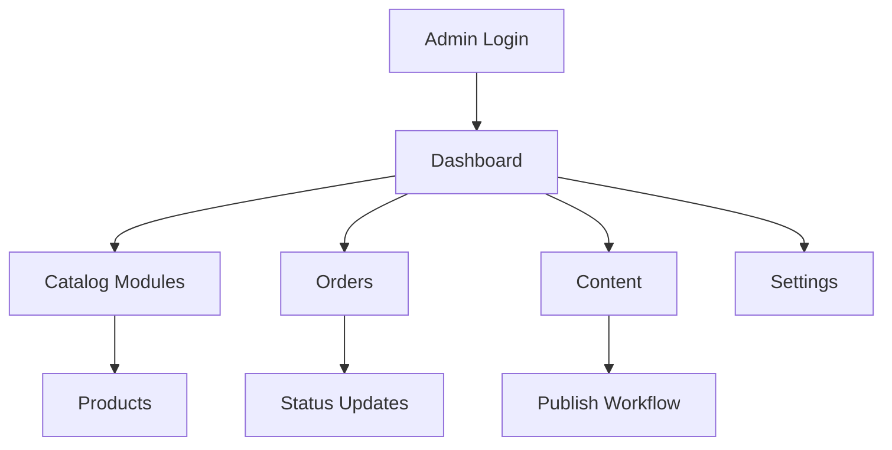

# Admin Panel

## Table of Contents
- [Overview](#overview)
- [Administration Principles](#administration-principles)
- [Module Catalog](#module-catalog)
- [Access Model](#access-model)
- [Workflow Standards](#workflow-standards)
- [Notes](#notes)
- [Best Practices](#best-practices)
- [Future Considerations](#future-considerations)
- [Examples](#examples)
- [Mermaid Diagram](#mermaid-diagram)

## Overview
The Unnati Shop admin panel is the internal operating surface for catalog maintenance, order handling, content management, customer support, reporting, and configuration. It is not a separate application; it is the privileged area of the same Laravel backend.

The admin panel must be permission-driven, audit-friendly, and optimized for safe daily operations.

## Administration Principles
| Principle | Standard |
|---|---|
| Safety first | Destructive actions require explicit permissions and confirmation |
| Auditability | Log state changes for users, orders, settings, and content |
| Efficiency | Use bulk actions where they reduce repetitive work |
| Consistency | Use the same grid, form, and detail page patterns across modules |
| Minimal privilege | Expose only the capabilities each role needs |

## Module Catalog
| Module | Purpose | Pages | Permissions | Workflow |
|---|---|---|---|---|
| Dashboard | Operational snapshot | KPIs, charts, alerts, recent activity | `dashboard.view` | Review store health and open tasks |
| Users | Manage customer and staff accounts | List, detail, create, edit, status | `user.view`, `user.create`, `user.edit`, `user.delete`, `user.status` | Search user, update profile, suspend if needed |
| Roles | Manage role definitions | List, create, edit, assign permissions | `role.view`, `role.create`, `role.edit`, `role.delete` | Create role, attach permissions, validate scope |
| Permissions | Maintain permission catalog | List, sync, assign matrix | `permission.view`, `permission.assign`, `permission.sync` | Seed, review, and synchronize permission sets |
| Categories | Organize catalog | List, create, edit, reorder | `category.view`, `category.create`, `category.edit`, `category.delete`, `category.reorder` | Manage hierarchy and visibility |
| Brands | Maintain brand taxonomy | List, create, edit, delete | `brand.view`, `brand.create`, `brand.edit`, `brand.delete` | Ensure brand metadata and logo quality |
| Products | Manage sellable items | List, create, edit, media, publish | `product.view`, `product.create`, `product.edit`, `product.delete`, `product.publish`, `product.feature` | Prepare content, stock, media, and publish |
| Orders | Fulfillment operations | List, detail, status, cancel, refund, export | `order.view`, `order.edit`, `order.cancel`, `order.status`, `order.refund`, `order.export` | Confirm payment, pack, ship, close |
| Coupons | Promotion management | List, create, edit, activate | `coupon.view`, `coupon.create`, `coupon.edit`, `coupon.delete`, `coupon.activate` | Define rules and limit usage |
| Blogs | Content publishing | List, create, edit, publish | `blog.view`, `blog.create`, `blog.edit`, `blog.delete`, `blog.publish` | Draft, review, schedule, publish |
| Pages | CMS page management | List, create, edit, publish | `page.view`, `page.create`, `page.edit`, `page.delete`, `page.publish` | Maintain policy and informational pages |
| Settings | Store configuration | Groups, edit forms, media | `setting.view`, `setting.edit` | Update operational configuration |
| Logs | Audit and diagnostics | Activity stream, filters, export | `log.view`, `log.export`, `log.purge` | Investigate events and retain evidence |
| Reports | Business intelligence | Sales, inventory, customer, content reports | `report.view`, `report.export` | Review trends and export summaries |

## Access Model
| Area | Rule |
|---|---|
| Route access | Protect all admin routes with auth plus permission checks |
| Page rendering | Hide UI actions that the user cannot perform |
| Data access | Never rely on hidden buttons alone; enforce checks in backend logic |
| Sensitive operations | Require confirmation for deletion, cancellation, refunds, and publishing |
| Session policy | Use tighter session rules for privileged users than for customers |

## Workflow Standards
| Workflow | Required Steps |
|---|---|
| Create product | Validate inputs, save product, upload media, set inventory, publish only when ready |
| Handle order | Review order, confirm payment, reserve stock, update status, record history |
| Publish blog | Draft, preview, validate SEO fields, publish, then index for sitemap |
| Edit setting | Validate type and access scope, persist safely, clear caches if needed |
| Resolve support issue | Search user, inspect order history, annotate ticket or log, avoid silent changes |

## Notes
- Admin UX should not expose raw internal identifiers unless they help operational work.
- The panel should prefer dense, data-rich screens for power users, but still remain readable on smaller displays.

## Best Practices
- Use server-side pagination, search, and filters for large tables.
- Present destructive actions with a clear undo or confirmation strategy where possible.
- Keep all admin actions auditable, especially any change to permissions, order totals, or settings.
- Reuse layout patterns between modules to reduce cognitive load.

## Future Considerations
- Add dashboards per role, such as support-only or catalog-only views.
- Add queued exports for large reports instead of blocking the UI.
- Introduce reusable admin table components for filters, actions, and empty states.

## Examples
| Screen | Primary Actions |
|---|---|
| Product list | Search, filter, edit, publish, feature |
| Order detail | View timeline, change status, print invoice, refund |
| Settings form | Edit grouped configuration and clear cached values |

## Mermaid Diagram

