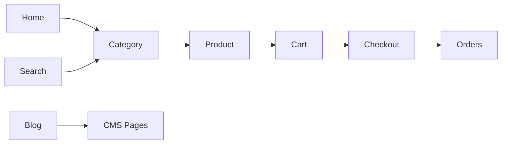

# Frontend

## Table of Contents
- [Overview](#overview)
- [Frontend Principles](#frontend-principles)
- [Customer Page Map](#customer-page-map)
- [Layout Standards](#layout-standards)
- [Interaction Rules](#interaction-rules)
- [Notes](#notes)
- [Best Practices](#best-practices)
- [Future Considerations](#future-considerations)
- [Examples](#examples)
- [Mermaid Diagram](#mermaid-diagram)

## Overview
The Unnati Shop frontend is a Blade-first storefront delivered through Laravel with Bootstrap 5.3 and JavaScript. It must serve both conversion and discoverability goals: fast browsing, clear product discovery, a safe checkout flow, and strong SEO support.

The frontend should remain content-rich but operationally simple. Anything that affects business state must pass through validated backend workflows.

## Frontend Principles
| Principle | Standard |
|---|---|
| Conversion first | Product discovery and checkout should be friction-light |
| Mobile ready | Key paths must work well on narrow screens |
| Trust signals | Show stock, delivery, policies, and support access clearly |
| Accessibility | Semantic markup, focus states, readable contrast |
| SEO aware | Use crawlable content, structured data, and stable URLs |

## Customer Page Map
| Page | Purpose | Key UI Elements | Data Source |
|---|---|---|---|
| Home | Entry and discovery | Hero, featured categories, featured products, offers, blog teasers | Catalog, CMS, promotions |
| Category | Browse product groups | Category banner, filters, sort, product grid | Categories, products |
| Product | Evaluate a product | Gallery, price, stock, variants, specs, reviews | Product, inventory, reviews |
| Wishlist | Save items for later | Saved products, move to cart, remove | Wishlist data |
| Cart | Review items before checkout | Line items, coupon box, totals, shipping estimate | Cart data |
| Checkout | Complete purchase | Address, shipping, payment, order summary | Cart, address, payment |
| Orders | Track past purchases | Order list, detail, status timeline | Orders, shipments |
| Profile | Manage account details | Name, email, phone, password | User profile |
| Address Book | Manage shipping locations | Saved addresses, default markers | Addresses |
| Blog | Read content and guidance | List, filters, article page | Blog categories, posts, tags |
| CMS | View policy pages | About, privacy, terms, shipping, returns | Pages |
| Contact | Reach support | Form, contact channels, map if used | Settings, contact records |
| Search | Find products and content | Search input, results, no-result help | Search index or query results |

## Layout Standards
| Area | Standard |
|---|---|
| Header | Logo, category nav, search, wishlist, cart, account |
| Footer | Policy links, support links, social links, newsletter if enabled |
| Product cards | Image, title, price, discount indicator, rating or stock badge |
| Forms | Clear labels, inline validation, and helpful error text |
| Empty states | Explain the state and give a next action |
| Loading states | Use skeletons or compact loaders for data-heavy views |

## Interaction Rules
| Interaction | Requirement |
|---|---|
| Add to cart | Immediate feedback and updated count |
| Coupon apply | Show server-validated result and adjusted totals |
| Checkout | Prevent progression until required fields are valid |
| Wishlist save | Allow logged-in persistence and graceful guest behavior |
| Search | Debounce on live suggestions if implemented; always submit a full search route |

## Notes
- The frontend should use the same naming and terminology as the admin panel so the system remains internally consistent.
- Product and CMS pages should prefer content freshness over over-animated presentation.

## Best Practices
- Keep reusable UI pieces as Blade components rather than duplicating markup.
- Minimize JavaScript to the interactions that actually need it.
- Load images responsively and avoid layout shifts.
- Keep forms short and progressive, especially on checkout.

## Future Considerations
- Add customer personalization to homepage recommendations.
- Introduce richer product comparison if catalog size justifies it.
- Add persisted filter state for category and search pages.

## Examples
| Page | Expected Pattern |
|---|---|
| Product detail | Sticky purchase block on desktop and compact CTA on mobile |
| Cart | Summary panel with subtotal, delivery estimate, and checkout CTA |
| Blog post | Article content with related posts and structured metadata |

## Mermaid Diagram

