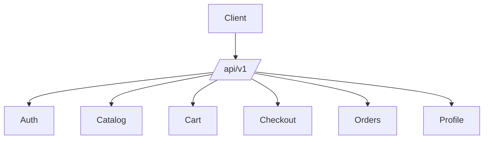

# API Design

## Table of Contents
- [Overview](#overview)
- [API Principles](#api-principles)
- [Authentication](#authentication)
- [Resource Groups](#resource-groups)
- [Endpoint Conventions](#endpoint-conventions)
- [Response Contract](#response-contract)
- [Errors and Status Codes](#errors-and-status-codes)
- [Pagination, Filtering, and Sorting](#pagination-filtering-and-sorting)
- [Notes](#notes)
- [Best Practices](#best-practices)
- [Future Considerations](#future-considerations)
- [Examples](#examples)
- [Mermaid Diagram](#mermaid-diagram)

## Overview
Unnati Shop APIs are designed for Sanctum-authenticated clients, including mobile apps, headless storefronts, and administrative integrations. The API must remain versioned, predictable, and conservative about response structure.

The public web application can remain Blade-first, but the API should still be treated as a first-class contract.

## API Principles
| Principle | Standard |
|---|---|
| Versioning | Use `/api/v1` from day one |
| Predictability | Stable endpoint names and response envelopes |
| Statelessness | Each request must carry the required auth context |
| Security | Enforce token abilities and rate limits |
| Extensibility | Leave room for new channels without breaking old clients |

## Authentication
| Client Type | Auth Method | Notes |
|---|---|---|
| Mobile app | Sanctum bearer token | Use token abilities per feature set |
| Headless storefront | Sanctum bearer token or session bridge if approved | Keep scopes narrow |
| Admin integrations | Sanctum token with administrative abilities | Restrict by role and ability |

## Resource Groups
| Group | Resources |
|---|---|
| Auth | Login, register, OTP verify, forgot password, logout |
| Catalog | Categories, brands, products, search, featured content |
| Commerce | Cart, wishlist, checkout, orders, addresses, payments |
| Content | Blogs, pages, contact forms |
| Profile | User profile, password, session management |

## Endpoint Conventions
### Base Rules
- Use nouns, not verbs.
- Use plural resource names.
- Use nested resources only when the ownership is clear.
- Keep write actions idempotent where practical.

### Suggested Endpoint Map
| Method | Endpoint | Purpose |
|---|---|---|
| POST | `/api/v1/auth/login` | Authenticate and issue token or session response |
| POST | `/api/v1/auth/register` | Start OTP registration |
| POST | `/api/v1/auth/verify-otp` | Verify registration or login OTP |
| POST | `/api/v1/auth/forgot-password` | Initiate password recovery |
| POST | `/api/v1/auth/reset-password` | Complete password recovery |
| GET | `/api/v1/categories` | List categories |
| GET | `/api/v1/categories/{slug}` | Show category |
| GET | `/api/v1/products` | List products |
| GET | `/api/v1/products/{slug}` | Show product detail |
| GET | `/api/v1/search` | Search catalog and content |
| GET | `/api/v1/cart` | View current cart |
| POST | `/api/v1/cart/items` | Add item to cart |
| PATCH | `/api/v1/cart/items/{id}` | Update cart item quantity |
| DELETE | `/api/v1/cart/items/{id}` | Remove cart item |
| POST | `/api/v1/checkout` | Place order |
| GET | `/api/v1/orders` | List customer orders |
| GET | `/api/v1/orders/{orderNumber}` | Show order detail |
| GET | `/api/v1/profile` | Show authenticated profile |
| PATCH | `/api/v1/profile` | Update profile |
| GET | `/api/v1/blog/posts` | List blog posts |
| GET | `/api/v1/blog/posts/{slug}` | Show blog post |
| POST | `/api/v1/contact` | Submit contact request |

## Response Contract
Use a consistent envelope so clients can parse errors and payloads uniformly.

| Field | Meaning |
|---|---|
| `success` | Boolean request outcome |
| `message` | Human-readable message |
| `data` | Primary payload |
| `errors` | Validation or request errors |
| `meta` | Pagination and auxiliary metadata |

### Example Success Shape
| Key | Purpose |
|---|---|
| `success` | Indicates successful processing |
| `message` | Describes result |
| `data` | Contains the resource or collection |

## Errors and Status Codes
| Status | Usage |
|---|---|
| 200 | Successful GET or update |
| 201 | Resource created |
| 204 | Successful deletion with no body |
| 400 | Invalid request shape or business rule failure |
| 401 | Unauthenticated |
| 403 | Authenticated but unauthorized |
| 404 | Resource not found |
| 422 | Validation error |
| 429 | Rate limit exceeded |
| 500 | Unhandled server error |

## Pagination, Filtering, and Sorting
| Capability | Standard |
|---|---|
| Pagination | Use page-based pagination with a consistent meta block |
| Filtering | Support status, category, brand, date range, and price filters where relevant |
| Sorting | Support `sort` and `direction` or a documented sort key list |
| Search | Support full-text or indexed keyword search for products and content |

### Common Query Parameters
| Parameter | Example | Meaning |
|---|---|---|
| `page` | `2` | Page number |
| `per_page` | `24` | Items per page |
| `sort` | `price` | Sort field |
| `direction` | `asc` | Sort direction |
| `filter[category]` | `electronics` | Category filter |
| `filter[brand]` | `acme` | Brand filter |
| `search` | `wireless` | Keyword search |

## Notes
- API responses should expose public storefront data without leaking internal IDs unless they are required for client workflows.
- The contract should remain stable enough that a mobile client can evolve independently of Blade templates.

## Best Practices
- Validate every request at the boundary.
- Scope Sanctum tokens with the smallest viable ability set.
- Return deterministic validation errors so frontend clients can map them safely.
- Keep write endpoints free from presentation concerns.

## Future Considerations
- Add API resources or transformers for long-lived response stability.
- Introduce webhooks for payment and order lifecycle events.
- Add admin-specific APIs only if the admin UI becomes partially decoupled.

## Examples
| Request | Response Expectation |
|---|---|
| `GET /api/v1/products?filter[category]=shoes` | Paginated filtered product collection |
| `POST /api/v1/cart/items` | Cart item created or merged |
| `POST /api/v1/auth/login` | Token or session handshake response |

## Mermaid Diagram

