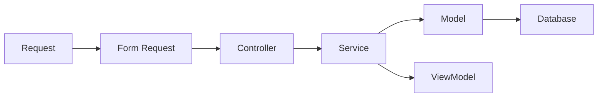

# Coding Standards

## Table of Contents
- [Overview](#overview)
- [Core Standards](#core-standards)
- [Architectural Rules](#architectural-rules)
- [Naming Conventions](#naming-conventions)
- [Validation and Errors](#validation-and-errors)
- [Database and Query Rules](#database-and-query-rules)
- [Notes](#notes)
- [Best Practices](#best-practices)
- [Future Considerations](#future-considerations)
- [Examples](#examples)
- [Mermaid Diagram](#mermaid-diagram)

## Overview
Unnati Shop follows PSR-12 and a service-layer implementation style. The standards here are meant to keep the codebase maintainable as the platform grows from authentication scaffolding into a full commerce system.

## Core Standards
| Area | Standard |
|---|---|
| PHP style | PSR-12, strict naming, readable control flow |
| Framework use | Use Laravel conventions where they reduce friction |
| Business logic | Keep it in services or actions, not controllers |
| Reuse | Prefer shared services over duplicated helper logic |
| Maintainability | Optimize for clarity over cleverness |

## Architectural Rules
| Rule | Expectation |
|---|---|
| Controllers | Receive request, invoke service, return response |
| Services | Contain business workflows and orchestration |
| Form Requests | Handle validation and authorization at the edge |
| Models | Encapsulate persistence relations and simple accessors only |
| Views | Render data only; no policy or workflow logic |
| Repositories | Not default; add only if a true persistence abstraction is needed |

## Naming Conventions
| Artifact | Convention | Example |
|---|---|---|
| Classes | Singular, descriptive, PascalCase | `RegistrationService` |
| Methods | Verb first, purpose clear | `createPendingRegistration` |
| Properties | Snake case in database, camelCase in PHP | `last_login_at` / `$lastLoginAt` |
| Permissions | `module.action` | `product.publish` |
| Routes | Verb-free nouns for resources | `orders`, `products` |
| Views | Feature and page oriented | `auth.register` |

## Validation and Errors
| Area | Standard |
|---|---|
| Validation | Validate at the request boundary, not deep in the service unless necessary |
| Error messages | User-friendly, non-revealing, and consistent |
| Exceptions | Throw domain-specific exceptions where they improve clarity |
| Logging | Log sensitive operational events without secrets |

## Database and Query Rules
| Rule | Standard |
|---|---|
| N+1 prevention | Eager load relations when rendering lists or details |
| Money | Use decimal fields and system-calculated totals |
| Transactions | Wrap multi-step writes in transactions |
| Indexing | Add indexes for foreign keys, lookup columns, and sort fields |
| Soft deletes | Use on recoverable content and catalog entities |

## Notes
- The codebase already contains `Services`, `DTOs`, `Enums`, and `ViewModels` folders; these should be used intentionally, not as catch-all utilities.
- Utility helpers should remain minimal and focused.

## Best Practices
- Keep methods short enough that their intent is obvious.
- Prefer explicit return types.
- Move repeated workflow steps into services or actions early.
- Review generated code for readability before merging.

## Future Considerations
- Introduce static analysis and architecture checks when the team grows.
- Add code-style enforcement in CI so formatting drift never reaches main.
- Consider module-level namespaces once the commerce surface becomes large.

## Examples
| Good | Avoid |
|---|---|
| `OrderService::placeOrder()` | Controller with 200 lines of checkout logic |
| `CouponService::validate()` | Duplicated coupon checks in multiple controllers |
| `ProductViewModel` | Complex Blade conditionals for catalog presentation |

## Mermaid Diagram

