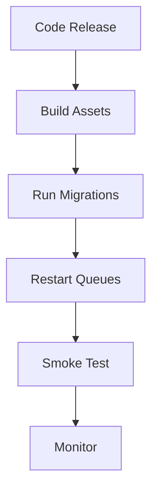

# Deployment

## Table of Contents
- [Overview](#overview)
- [Environment Targets](#environment-targets)
- [Build and Release Steps](#build-and-release-steps)
- [Runtime Services](#runtime-services)
- [Deployment Checklist](#deployment-checklist)
- [Rollback Strategy](#rollback-strategy)
- [Notes](#notes)
- [Best Practices](#best-practices)
- [Future Considerations](#future-considerations)
- [Examples](#examples)
- [Mermaid Diagram](#mermaid-diagram)

## Overview
Unnati Shop should be deployed as a standard Laravel application with clear separation between build-time assets and runtime services. Deployment must preserve database integrity, cache correctness, and user session stability.

## Environment Targets
| Environment | Purpose | Data Policy |
|---|---|---|
| Local | Developer workstation | Disposable and reset-friendly |
| Staging | Pre-release validation | Production-like but non-public data |
| Production | Live commerce system | Controlled access and backups required |

## Build and Release Steps
| Step | Action |
|---|---|
| 1 | Pull approved release branch |
| 2 | Install dependencies |
| 3 | Run asset build with Vite |
| 4 | Apply database migrations |
| 5 | Clear and rebuild caches as needed |
| 6 | Restart queues and workers |
| 7 | Smoke test critical storefront and admin paths |
| 8 | Monitor logs and metrics after release |

## Runtime Services
| Service | Requirement |
|---|---|
| Web server | Serve Laravel public directory and static assets |
| PHP runtime | PHP 8.2+ with required extensions |
| Database | MySQL 8 with backups and indexed transactional tables |
| Queue worker | Process mail, exports, and background tasks |
| Scheduler | Run periodic cleanup, report generation, and token pruning |
| Cache | Use a fast cache backend in production |

## Deployment Checklist
| Area | Verification |
|---|---|
| Config | Environment variables present and correct |
| Storage | Writable storage and cache directories |
| Database | Migrations tested on staging first |
| Assets | Frontend build completed successfully |
| Queue | Workers active and healthy |
| Logs | Centralized or easily inspectable |
| Backups | Verified before release |
| Smoke test | Login, cart, checkout, and admin access checked |

## Rollback Strategy
| Scenario | Response |
|---|---|
| Asset failure | Revert to last known good build |
| Migration issue | Restore backup or apply down strategy only if safe |
| Application error | Roll back code and clear caches |
| Queue issue | Pause dispatching, fix worker, then resume |

## Notes
- Production releases should not rely on manual ad hoc changes after deployment.
- Any schema change must be documented before the release is approved.

## Best Practices
- Build assets in a controlled environment and deploy compiled output consistently.
- Run smoke tests against login, product browsing, cart, and checkout after every release.
- Keep backups before any irreversible schema migration.
- Monitor logs closely during the first minutes after cutover.

## Future Considerations
- Add zero-downtime deployment tooling if traffic grows enough to justify it.
- Introduce blue-green or rolling release methods for safer rollouts.
- Automate staging-to-production promotion checks.

## Examples
| Task | Expected Outcome |
|---|---|
| Releasing a catalog update | Assets built, migrations run, pages smoke tested |
| Releasing an auth change | Verify login, registration, and reset flows first |
| Releasing a settings change | Confirm caches are refreshed and config is consistent |

## Mermaid Diagram

