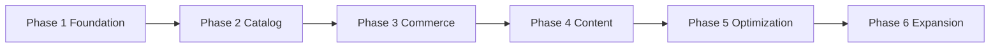

# Roadmap

## Table of Contents
- [Overview](#overview)
- [Delivery Phases](#delivery-phases)
- [Milestone Map](#milestone-map)
- [Release Priorities](#release-priorities)
- [Notes](#notes)
- [Best Practices](#best-practices)
- [Future Considerations](#future-considerations)
- [Examples](#examples)
- [Mermaid Diagram](#mermaid-diagram)

## Overview
The Unnati Shop roadmap is organized around platform readiness rather than feature count. The sequence should prioritize trust, operability, and revenue-critical flows before optional enhancements.

## Delivery Phases
| Phase | Goal | Primary Deliverables |
|---|---|---|
| Phase 1 | Platform foundation | Auth, RBAC, base layout, configuration, logging |
| Phase 2 | Catalog readiness | Categories, brands, products, media, inventory |
| Phase 3 | Commerce core | Cart, wishlist, checkout, orders, payments, shipment tracking |
| Phase 4 | Content and SEO | Blogs, CMS pages, structured metadata, sitemap |
| Phase 5 | Reporting and optimization | Dashboards, exports, caching, queues, performance hardening |
| Phase 6 | Expansion | Mobile API enhancements, automation, personalization, advanced analytics |

## Milestone Map
| Milestone | Entry Criteria | Exit Criteria |
|---|---|---|
| Auth complete | Login, OTP registration, reset flow available | Users can securely create and recover accounts |
| Admin base | Roles and permission matrix active | Internal users can safely operate the store |
| Catalog ready | Products, categories, brands, media live | Storefront can browse purchasable items |
| Checkout ready | Orders and payment flow stable | Customers can complete purchases |
| SEO ready | Metadata and sitemap in place | Pages can be discovered and indexed properly |

## Release Priorities
| Priority | Area | Reason |
|---|---|---|
| P0 | Authentication and authorization | Protects access to the rest of the system |
| P0 | Catalog and checkout | Directly affects revenue |
| P1 | Orders and support | Required for fulfillment and customer service |
| P1 | SEO and content | Improves acquisition and trust |
| P2 | Reporting and automation | Improves operations after the core flows are stable |

## Notes
- The roadmap should be revisited after each major release and adjusted based on business feedback.
- Any roadmap change that affects schema or permissions must be reflected in the matching docs.

## Best Practices
- Keep phases small enough that they can be validated independently.
- Avoid starting high-complexity features before the checkout core is stable.
- Tie roadmap items to measurable acceptance criteria.

## Future Considerations
- Add market-specific features such as regional shipping and localized tax rules.
- Add B2B capabilities if wholesale workflows become a business goal.
- Add loyalty and referral features only after the core funnel is efficient.

## Examples
| Feature | Likely Phase |
|---|---|
| OTP registration | Phase 1 |
| Product catalog | Phase 2 |
| Coupon engine | Phase 3 |
| XML sitemap | Phase 4 |

## Mermaid Diagram

