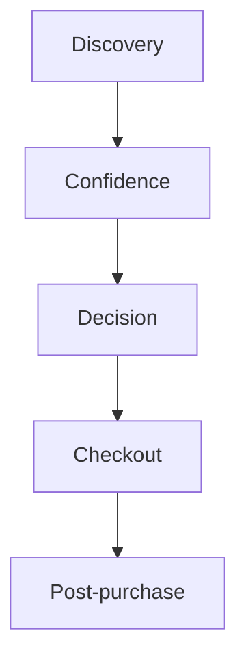

# UI and UX Guidelines

## Table of Contents
- [Overview](#overview)
- [Design Principles](#design-principles)
- [Visual System](#visual-system)
- [Component Standards](#component-standards)
- [Interaction Patterns](#interaction-patterns)
- [Notes](#notes)
- [Best Practices](#best-practices)
- [Future Considerations](#future-considerations)
- [Examples](#examples)
- [Mermaid Diagram](#mermaid-diagram)

## Overview
Unnati Shop should feel like a serious commerce platform, not a generic Laravel starter. The UX must communicate trust, product clarity, and checkout confidence while remaining efficient for power users in the admin panel.

## Design Principles
| Principle | Standard |
|---|---|
| Clarity | Show the next action and the current state |
| Trust | Display stock, pricing, shipping, and policy details clearly |
| Consistency | Reuse spacing, typography, and interaction patterns |
| Density with restraint | Admin screens can be information-rich without becoming noisy |
| Responsiveness | The core experience must remain usable on mobile |

## Visual System
| Element | Guideline |
|---|---|
| Typography | Use a readable hierarchy with strong heading contrast |
| Color | Use an identifiable brand palette with accessible contrast |
| Cards | Reserve cards for scan-friendly content like products and summaries |
| Buttons | Use a clear primary action and stable secondary actions |
| Forms | Keep labels visible and validation immediate |
| Feedback | Use success, warning, and error states consistently |

## Component Standards
| Component | Expected Behavior |
|---|---|
| Header | Search, account, wishlist, and cart must be easy to find |
| Product card | Show image, title, price, discount, and stock cue |
| Filter panel | On mobile, collapse into a clear drawer or accordion |
| Checkout summary | Persist while scrolling if layout allows |
| Admin table | Support search, filters, sort, and pagination |
| Empty state | Explain what is missing and how to proceed |

## Interaction Patterns
| Pattern | Rule |
|---|---|
| Primary CTA | One clear action per screen should dominate |
| Confirmations | Require confirmation for destructive actions |
| Validation | Show errors inline and near the field |
| Loading | Use skeletons or spinners instead of abrupt blank states |
| Feedback timing | Confirm success immediately after the server action completes |

## Notes
- The storefront should feel lighter and more narrative than the admin panel.
- The admin panel should favor density, search, and action efficiency.

## Best Practices
- Keep the checkout path visually simple.
- Avoid overloading users with unnecessary modal dialogs.
- Use consistent empty states so the system feels coherent.
- Preserve layout stability during image and data loading.

## Future Considerations
- Add design tokens or a theme file if the visual system expands further.
- Introduce motion only where it helps orientation or confirmation.
- Add localized layout adjustments if multilingual support is introduced.

## Examples
| Screen | Design Focus |
|---|---|
| Home | Discovery and trust |
| Product detail | Product confidence and conversion |
| Admin order page | Operational clarity and safe actioning |

## Mermaid Diagram

