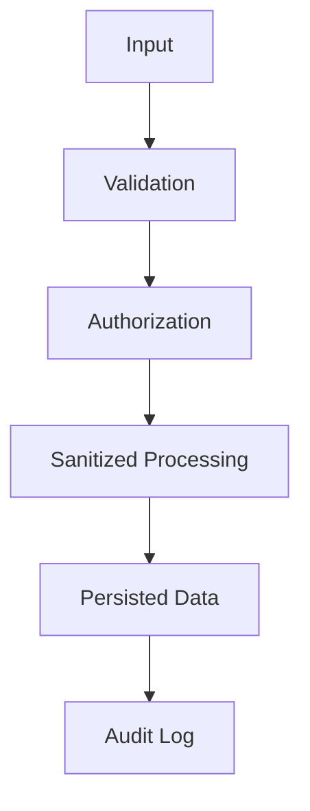

# Security

## Table of Contents
- [Overview](#overview)
- [Security Model](#security-model)
- [Web Security Controls](#web-security-controls)
- [Authentication Security](#authentication-security)
- [Data and File Safety](#data-and-file-safety)
- [Operational Security](#operational-security)
- [Notes](#notes)
- [Best Practices](#best-practices)
- [Future Considerations](#future-considerations)
- [Examples](#examples)
- [Mermaid Diagram](#mermaid-diagram)

## Overview
Security for Unnati Shop must be practical and layered. The platform handles customer identities, order history, and administrative access, so defensive controls need to be consistent across the web app, APIs, and supporting workflows.

## Security Model
| Layer | Control |
|---|---|
| Input | Validation, normalization, length limits, and type checks |
| Access | Authentication plus role/permission enforcement |
| Session | Secure cookies, regeneration, and timeout handling |
| Data | Hashed credentials, hashed OTPs, and guarded sensitive fields |
| Operations | Logging, throttling, backups, and monitoring |

## Web Security Controls
| Threat | Control |
|---|---|
| CSRF | Use CSRF tokens for state-changing web requests |
| XSS | Escape output, sanitize rich text, and restrict HTML input |
| SQL injection | Use Eloquent/query bindings instead of string concatenation |
| Clickjacking | Send framing protections through headers |
| Abuse | Apply rate limits to auth, contact, and OTP endpoints |

## Authentication Security
| Area | Standard |
|---|---|
| Passwords | Use Laravel hashing defaults |
| OTPs | Hash before storage, expire quickly, and limit attempts |
| Sessions | Regenerate after login and sensitive state changes |
| Cookies | Mark secure and HTTP-only in production |
| Admin login | Use tighter session and reauthentication policy than customers |
| Remember me | Limit scope and review risk for privileged users |

## Data and File Safety
| Control | Requirement |
|---|---|
| Validation | Validate file type, size, and image dimensions |
| Uploads | Store under controlled directories and never trust original filenames |
| Images | Reprocess or optimize uploaded media before public serving |
| Secrets | Keep secrets out of logs, database snapshots, and client responses |
| Export data | Gate sensitive exports and log their creation |

## Operational Security
| Control | Requirement |
|---|---|
| Authorization | Enforce permissions in backend logic |
| Audit logs | Record critical state changes and admin actions |
| Backups | Protect backups as sensitive data |
| Headers | Apply security headers consistently |
| Monitoring | Watch for repeated auth failures and unusual admin activity |

## Notes
- Security controls should be implemented at the boundary first, not after a vulnerability is discovered.
- Operational logs should help investigators without exposing secrets.

## Best Practices
- Use the same validation logic for web and API if the underlying resource is shared.
- Treat OTP endpoints as attack targets and rate limit accordingly.
- Never expose stack traces in production responses.
- Review any public-facing content editor for XSS exposure.

## Future Considerations
- Add optional two-factor authentication for admin accounts.
- Add security event notifications for risky actions such as role changes and mass exports.
- Add device/session management for customer self-service if needed.

## Examples
| Threat | Defense |
|---|---|
| Brute-force login | Throttle attempts and use generic messages |
| Malicious image upload | Validate MIME, extension, size, and dimensions |
| Unauthorized admin access | Gate all routes with auth plus permissions |

## Mermaid Diagram

