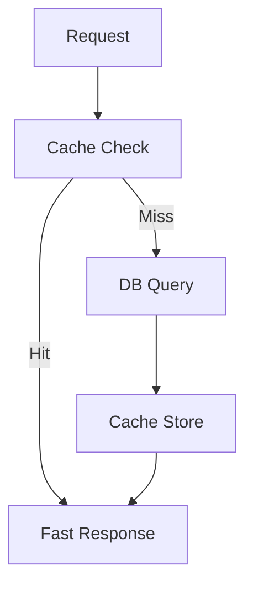

# Performance

## Table of Contents
- [Overview](#overview)
- [Performance Strategy](#performance-strategy)
- [Caching](#caching)
- [Database Efficiency](#database-efficiency)
- [Render Efficiency](#render-efficiency)
- [Media and Delivery](#media-and-delivery)
- [Notes](#notes)
- [Best Practices](#best-practices)
- [Future Considerations](#future-considerations)
- [Examples](#examples)
- [Mermaid Diagram](#mermaid-diagram)

## Overview
Unnati Shop must remain fast under catalog browsing, checkout, and admin activity. Performance work should focus on reducing repeated work, preventing inefficient queries, and serving media efficiently.

## Performance Strategy
| Area | Target |
|---|---|
| Browsing | Fast category and product list loading |
| Checkout | Low-latency validation and order creation |
| Admin | Responsive search, tables, and filters |
| API | Predictable response times for mobile clients |

## Caching
| Use Case | Recommended Cache |
|---|---|
| Navigation data | Category and brand menus |
| Settings | Store configuration values |
| Expensive reports | Precomputed report snapshots |
| Public content | Homepage blocks and CMS fragments where safe |

## Database Efficiency
| Topic | Standard |
|---|---|
| Indexes | Index foreign keys, status flags, slugs, and search columns |
| N+1 prevention | Eager load related models for list and detail pages |
| Query shape | Select only the columns a page needs |
| Transactions | Use for checkout, payment updates, and stock reservation |
| Pagination | Never load unbounded catalog or order lists |

## Render Efficiency
| Topic | Standard |
|---|---|
| Images | Use optimized sizes and lazy loading |
| Blade | Keep templates simple and avoid heavy computation |
| JavaScript | Use only for meaningful interactions |
| Asset delivery | Build and minify assets through Vite |

## Media and Delivery
| Control | Requirement |
|---|---|
| Product images | Compress and resize before public delivery |
| CDN | Recommended for production media delivery |
| Browser caching | Use sensible cache headers for static assets |
| Pagination | Use it on every high-volume listing |

## Notes
- Performance is a product feature. Poor performance directly affects conversion and admin productivity.
- The initial schema should already support the most common queries with proper indexes.

## Best Practices
- Profile the slowest pages first: home, category, product, cart, checkout, and admin lists.
- Avoid loading relation trees unless the page actually needs them.
- Precompute expensive counts and report aggregates when they are reused often.

## Future Considerations
- Add read replicas if the workload becomes heavily read dominated.
- Introduce background jobs for non-critical work like exports and mail.
- Consider search indexing if catalog size becomes large.

## Examples
| Scenario | Preferred Optimization |
|---|---|
| Product grid | Eager load category and primary image |
| Admin order list | Paginate and filter server-side |
| Report page | Use cached snapshot instead of live aggregation |

## Mermaid Diagram

