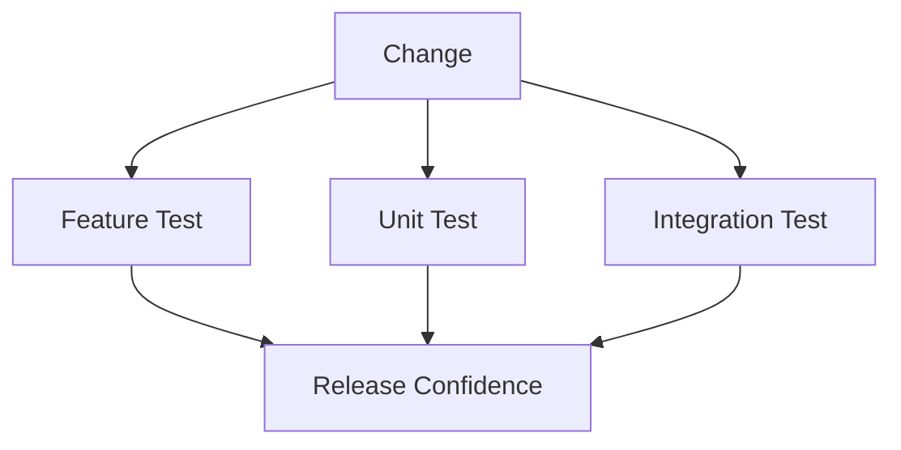

# Testing

## Table of Contents
- [Overview](#overview)
- [Testing Strategy](#testing-strategy)
- [Feature Tests](#feature-tests)
- [Unit Tests](#unit-tests)
- [Integration Tests](#integration-tests)
- [Coverage Priorities](#coverage-priorities)
- [Notes](#notes)
- [Best Practices](#best-practices)
- [Future Considerations](#future-considerations)
- [Examples](#examples)
- [Mermaid Diagram](#mermaid-diagram)

## Overview
Testing in Unnati Shop should validate real business behavior, not just framework mechanics. The highest priority is protecting authentication, checkout, authorization, and data integrity.

## Testing Strategy
| Test Type | Purpose | Example |
|---|---|---|
| Feature | Validate end-to-end user flows | Register, login, checkout |
| Unit | Validate isolated business rules | OTP generator, coupon rules |
| Integration | Validate interactions with DB or services | Payment recording, role sync |

## Feature Tests
| Area | Required Coverage |
|---|---|
| Authentication | Login, registration OTP, password reset, logout |
| Authorization | Role and permission gated routes |
| Storefront | Home, category, product, cart, checkout |
| Admin | Dashboard, catalog, orders, content, settings |
| APIs | Authenticated and unauthenticated access paths |

## Unit Tests
| Target | What to Verify |
|---|---|
| OTP service | Generation, hashing, and verification behavior |
| Registration service | Pending registration creation and state rules |
| Pricing logic | Discounts, coupons, and totals |
| Status transitions | Allowed order lifecycle changes |

## Integration Tests
| Scenario | Expected Result |
|---|---|
| Login session | Session regeneration and last login tracking |
| Permission assignment | Role changes reflected in access checks |
| Order placement | Order rows, items, and payment records written together |
| File upload | Validation and storage behavior applied correctly |

## Coverage Priorities
| Priority | Area |
|---|---|
| P0 | Authentication, authorization, checkout, payment, and inventory |
| P1 | Catalog management, CMS publishing, and profile updates |
| P2 | Reports, logs, and non-critical admin tools |

## Notes
- Tests should reflect actual user journeys and operational risk.
- Whenever schema or permission rules change, the affected tests must be updated in the same change set.

## Best Practices
- Use factories and seeders to create realistic test data.
- Assert both positive and negative paths for security-sensitive flows.
- Keep tests deterministic and independent of execution order.
- Cover the business rule, not just the response code.

## Future Considerations
- Add browser tests for critical storefront journeys if the UI grows complex.
- Add API contract tests for version stability.
- Add performance regression checks for critical pages if needed.

## Examples
| Test Name | Focus |
|---|---|
| `it_can_register_a_customer_with_otp` | Registration flow |
| `it_prevents_unauthorized_order_editing` | RBAC enforcement |
| `it_calculates_order_totals_correctly` | Checkout integrity |

## Mermaid Diagram

