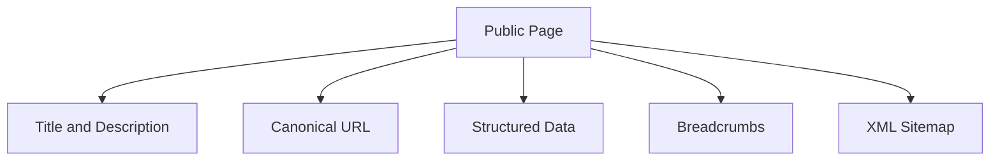

# SEO

## Table of Contents
- [Overview](#overview)
- [SEO Strategy](#seo-strategy)
- [Metadata Rules](#metadata-rules)
- [Content Discovery](#content-discovery)
- [Technical SEO](#technical-seo)
- [Notes](#notes)
- [Best Practices](#best-practices)
- [Future Considerations](#future-considerations)
- [Examples](#examples)
- [Mermaid Diagram](#mermaid-diagram)

## Overview
Unnati Shop should be discoverable through clean URLs, meaningful metadata, structured data, and crawlable content. SEO is not limited to blogs; it also applies to category pages, product detail pages, and CMS content.

## SEO Strategy
| Area | Standard |
|---|---|
| Product pages | Unique titles, descriptions, canonical URLs, and product schema |
| Category pages | Strong category text, internal links, and stable slugs |
| Blog posts | Editorial metadata and article schema |
| CMS pages | Policy and informational pages optimized for clarity |
| Search | Indexable only when it adds value; avoid thin duplicate pages |

## Metadata Rules
| Element | Rule |
|---|---|
| Title tag | Unique, concise, and page-specific |
| Meta description | Summarize value, not keyword spam |
| Canonical | Required for pages with duplicate or parameterized variants |
| Open Graph | Set title, description, and image for social sharing |
| Twitter cards | Provide matching social metadata |

## Content Discovery
| Topic | Standard |
|---|---|
| Breadcrumbs | Display on category, product, and blog pages |
| Internal linking | Connect categories, products, blogs, and CMS pages naturally |
| Slugs | Human-readable and stable |
| XML sitemap | Include public pages, categories, products, and publishable content |
| Robots | Block private, authenticated, and thin utility pages |

## Technical SEO
| Topic | Standard |
|---|---|
| Structured data | Add Product, Breadcrumb, Article, and Organization schema where relevant |
| Pagination | Use indexable paginated category/blog pages with clear canonical strategy |
| Images | Use descriptive alt text and optimized file sizes |
| Speed | Keep pages fast because performance impacts ranking and conversion |

## Notes
- The SEO plan should be implemented with the content model, not retrofitted after launch.
- Slug stability matters because it reduces redirect complexity and protects backlinks.

## Best Practices
- Write unique copy for the most important commercial pages.
- Keep metadata aligned with the actual content of the page.
- Use canonical URLs to avoid duplicate content from filters or tracking parameters.
- Generate the sitemap automatically when content changes.

## Future Considerations
- Add localized SEO if the store expands into multiple regions or languages.
- Add structured data enhancements for rich results if the content model supports them.
- Add server-side search page handling only if the pages provide real value to search engines.

## Examples
| Page | SEO Focus |
|---|---|
| Product detail | Product name, brand, price, availability |
| Category page | Category intent and internal linking |
| Blog post | Article schema and strong excerpt |

## Mermaid Diagram

