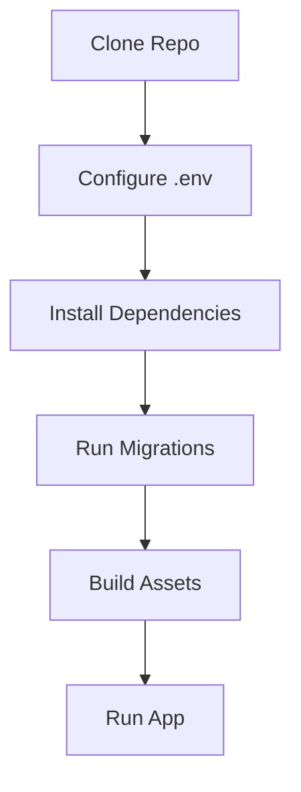

# Environment Setup

## Table of Contents
- [Overview](#overview)
- [Prerequisites](#prerequisites)
- [Local Setup](#local-setup)
- [Environment Variables](#environment-variables)
- [Service Expectations](#service-expectations)
- [Notes](#notes)
- [Best Practices](#best-practices)
- [Future Considerations](#future-considerations)
- [Examples](#examples)
- [Mermaid Diagram](#mermaid-diagram)

## Overview
This document defines the expected environment for developers working on Unnati Shop. The goal is predictable local setup, consistent configuration across environments, and minimal surprises during deployment.

## Prerequisites
| Dependency | Requirement |
|---|---|
| PHP | 8.2 or higher |
| Composer | Current stable release |
| Node.js | Current LTS suitable for Vite |
| Database | MySQL 8 |
| Web server | Apache, Nginx, or equivalent local stack |

## Local Setup
| Step | Action |
|---|---|
| 1 | Clone the repository |
| 2 | Install PHP dependencies |
| 3 | Copy environment template to `.env` |
| 4 | Generate application key |
| 5 | Configure database connection |
| 6 | Run migrations and seed data if available |
| 7 | Install Node dependencies |
| 8 | Run the frontend build or dev server |

## Environment Variables
| Variable Category | Examples | Purpose |
|---|---|---|
| App | `APP_NAME`, `APP_ENV`, `APP_URL` | Core application identity |
| Database | `DB_CONNECTION`, `DB_HOST`, `DB_DATABASE`, `DB_USERNAME`, `DB_PASSWORD` | Persistence settings |
| Mail | Mail host, port, encryption, sender | OTP and transactional email |
| Queue | Queue connection and retry settings | Background work |
| Cache | Cache store and driver | Configuration and data caching |
| Storage | Filesystem and cloud adapter settings | Media and exports |

## Service Expectations
| Service | Local Expectation |
|---|---|
| Database | Available and writable |
| Mail | Mailhog, SMTP test server, or equivalent safe sink |
| Queue | Local worker or sync mode during development |
| Cache | File or local cache is acceptable for development |

## Notes
- Developers should not rely on production secrets in local environments.
- Any change to environment shape should be reflected in this document and in the sample env file.

## Best Practices
- Keep environment names and credentials aligned across teammates.
- Use a consistent local database reset strategy when testing migrations.
- Do not commit real secrets.

## Future Considerations
- Add environment templates for staging and production if the project grows across multiple hosts.
- Add smoke-check scripts that validate required env vars before boot.

## Examples
| Setting | Example Use |
|---|---|
| `APP_ENV=local` | Developer workstation |
| `QUEUE_CONNECTION=database` | Background jobs in shared environments |
| `MAIL_MAILER=smtp` | Transactional email delivery |

## Mermaid Diagram

