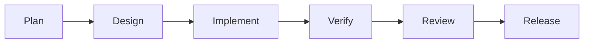

# Development Workflow

## Table of Contents
- [Overview](#overview)
- [Workflow Stages](#workflow-stages)
- [Definition of Done](#definition-of-done)
- [Change Management](#change-management)
- [Notes](#notes)
- [Best Practices](#best-practices)
- [Future Considerations](#future-considerations)
- [Examples](#examples)
- [Mermaid Diagram](#mermaid-diagram)

## Overview
The development workflow for Unnati Shop should keep every feature traceable from idea to release. The process needs to support a service-layer Laravel codebase and ensure that schema, permissions, tests, and UX stay aligned.

## Workflow Stages
| Stage | Output |
|---|---|
| Plan | Scope, acceptance criteria, and affected modules |
| Design | Schema, flows, permissions, and API or UI contract |
| Implement | Services, requests, models, views, and supporting code |
| Verify | Automated tests and manual smoke checks |
| Review | Code review and architecture checks |
| Release | Merge, deploy, monitor, and document |

## Definition of Done
| Area | Requirement |
|---|---|
| Functionality | Feature behaves as documented |
| Validation | Inputs and errors handled correctly |
| Security | Permissions and rate limits applied |
| Tests | Relevant feature and unit tests updated |
| Performance | No obvious inefficiency introduced |
| Documentation | User-facing or architecture docs updated if needed |

## Change Management
| Change Type | Expected Action |
|---|---|
| Schema change | Update database doc and test migration impact |
| Permission change | Update RBAC doc, seeders, and admin access rules |
| API change | Update API contract and versioning notes |
| UI change | Update frontend or UI/UX guideline docs |
| Release change | Update release process and deployment expectations |

## Notes
- Small, complete changes are preferred over large mixed-purpose changes.
- A feature is not done until its operational impact is understood.

## Best Practices
- Keep each pull request focused on one business area.
- Update documentation in the same change set as the implementation whenever possible.
- Validate edge cases before merging, not after release.

## Future Considerations
- Add feature flags for larger changes that need staged rollout.
- Add an internal change log for major platform decisions.
- Add release sign-off gates if multiple teams contribute concurrently.

## Examples
| Work Item | Workflow Touchpoints |
|---|---|
| New coupon module | Design, schema, service, admin UI, tests, docs |
| New API endpoint | Design, validation, auth, response contract, tests |
| New settings screen | Schema, permissions, admin module, cache behavior |

## Mermaid Diagram

