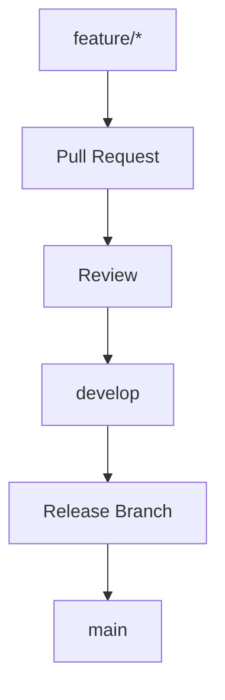

# Git Workflow

## Table of Contents
- [Overview](#overview)
- [Branch Model](#branch-model)
- [Commit Standards](#commit-standards)
- [Review Rules](#review-rules)
- [Notes](#notes)
- [Best Practices](#best-practices)
- [Future Considerations](#future-considerations)
- [Examples](#examples)
- [Mermaid Diagram](#mermaid-diagram)

## Overview
The Git workflow for Unnati Shop should favor small, reviewable changes and a clean history. The branch model should support feature development without losing control over release quality.

## Branch Model
| Branch | Purpose |
|---|---|
| `main` | Production-ready history |
| `develop` | Integration branch for upcoming work |
| `feature/*` | Individual features or modules |
| `fix/*` | Non-urgent corrective work |
| `hotfix/*` | Production emergency fixes |

## Commit Standards
| Rule | Standard |
|---|---|
| Scope | One logical change per commit when practical |
| Message | Imperative and specific |
| Noise | Avoid commits that only reformat unrelated files |
| Traceability | Reference issue or ticket when applicable |

## Review Rules
| Rule | Expectation |
|---|---|
| Scope control | Review should stay focused on the intended feature |
| Tests | Relevant tests must pass or be added |
| Documentation | Docs updated when architecture, schema, or workflow changes |
| Risk | High-risk changes should call out rollback and migration impact |

## Notes
- Merge requests should be small enough that reviewers can verify behavior without guesswork.
- Do not hide unrelated edits inside feature branches.

## Best Practices
- Rebase or merge thoughtfully, depending on the team standard, but keep history readable.
- Use descriptive branch names tied to the module or issue.
- Avoid long-lived branches that drift too far from current mainline behavior.

## Future Considerations
- Add branch protection rules for `main` and `develop`.
- Add automated checks for commit message format if the team wants stricter hygiene.

## Examples
| Branch Name | Intended Use |
|---|---|
| `feature/product-catalog` | Catalog implementation |
| `fix/otp-resend-rate-limit` | Targeted bug fix |
| `hotfix/order-total` | Urgent production correction |

## Mermaid Diagram

