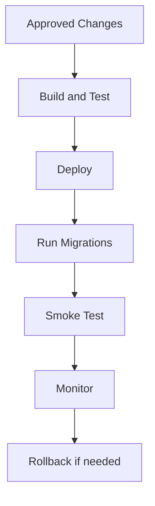

# Release Process

## Table of Contents
- [Overview](#overview)
- [Release Philosophy](#release-philosophy)
- [Release Steps](#release-steps)
- [Pre-Release Checks](#pre-release-checks)
- [Post-Release Checks](#post-release-checks)
- [Rollback Strategy](#rollback-strategy)
- [Notes](#notes)
- [Best Practices](#best-practices)
- [Future Considerations](#future-considerations)
- [Examples](#examples)
- [Mermaid Diagram](#mermaid-diagram)

## Overview
The release process for Unnati Shop must protect checkout, authentication, and admin operations. Releases should be repeatable, documented, and safe to reverse if the business impact is unacceptable.

## Release Philosophy
| Principle | Standard |
|---|---|
| Predictability | Use a repeatable release checklist |
| Safety | Verify critical flows before and after deployment |
| Traceability | Every release should be tied to a commit range or tag |
| Reversibility | Keep rollback options realistic and tested |

## Release Steps
| Step | Action |
|---|---|
| 1 | Confirm release scope and approvals |
| 2 | Merge approved changes into the release branch |
| 3 | Run automated tests and build assets |
| 4 | Back up production data where required |
| 5 | Deploy code and execute migrations carefully |
| 6 | Clear and rebuild caches if needed |
| 7 | Restart queues and schedule workers |
| 8 | Perform smoke tests |
| 9 | Monitor logs and metrics |

## Pre-Release Checks
| Check | Verification |
|---|---|
| Tests | Required automated tests pass |
| Schema | Migration risk reviewed |
| Permissions | New access rules documented and seeded |
| Assets | Frontend build succeeds |
| Rollback | A rollback approach is defined |

## Post-Release Checks
| Check | Verification |
|---|---|
| Login | Customer and admin login works |
| Browse | Category and product pages load correctly |
| Checkout | Cart and order placement succeed |
| Admin | Key admin modules are accessible by role |
| Logs | No new critical errors or performance regressions |

## Rollback Strategy
| Scenario | Response |
|---|---|
| Broken build | Revert to previous release artifact |
| Migration failure | Restore backup or apply safe corrective migration |
| Checkout regression | Roll back immediately and investigate |
| Auth regression | Treat as priority incident |

## Notes
- Releases should not be improvisational.
- If a change alters order totals, permissions, or customer account access, the release deserves extra scrutiny.

## Best Practices
- Release one meaningful group of related changes at a time.
- Keep a short, explicit release checklist in the repository or release notes.
- Verify smoke tests on both desktop and mobile viewports where relevant.

## Future Considerations
- Add automated canary or staged rollouts for mature infrastructure.
- Add telemetry-based release gates if the platform becomes high traffic.
- Add post-release incident templates for rapid triage.

## Examples
| Release Type | Focus |
|---|---|
| Auth release | Registration, login, OTP, password reset |
| Commerce release | Product browsing, cart, checkout, order confirmation |
| Content release | CMS, blog, SEO metadata |

## Mermaid Diagram

